# Alert Types, Targets, and Parameters

To create and enable an Alert, you need to specify and configure the following components:

* **Alert Type:** On-chain event that triggers Tenderly to send you a notification. There are 12 alert triggers to choose from.
* **Alert Target:** Address or addresses you want to monitor. The Target options are the same across all Alert Types and include:
  * **Address:** Monitor a single address.
  * **Network:** Monitor all addresses deployed on a network of your choice.
  * **Project:** Monitor all addresses that are part of a project on Tenderly.
  * **Tag:** Monitor all contracts and wallets labeled with the specific tag.
* **Alert Parameters:** Additional settings specific to the selected Alert Type.
* **Alert Destination:** The place where you want to receive notifications. One Alert can send notifications to multiple destinations. There are 8 destinations where you can send and receive notifications.

The rest of this document focuses on different Alert Types.


Read the [Alerting Quickstart guide](tutorials-and-quickstarts/alerting-quickstart-guide.md) to learn the steps for setting up an example Alert and enabling it.


## Successful Transaction

<figure>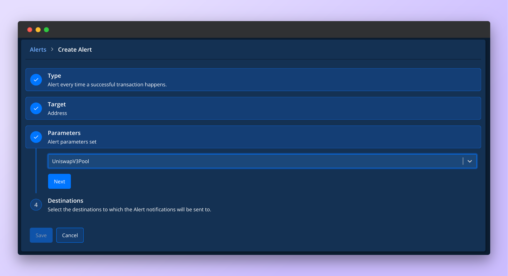<figcaption>
Parameters for the Successful Transaction Alert
</figcaption></figure>

The Successful Transaction alert sends a notification when a new transaction is created and added to the blockchain. This alert is commonly used for monitoring transactions that call a specific smart contract or transactions sent or received by a specific wallet.

To create a Successful Transaction alert, complete the following steps:

1. **Select Successful Transaction** from the list of Alert Types.
2. From the Target section, **select Address** to monitor a single address.
3. **Choose the address of the smart contract** from the dropdown.
4. [**Set the Destination**](configuring-alert-destinations/) by creating a new one or select one you previously created.
5. **Click Save** to get notified when a transaction goes through successfully.

## Failed Transaction

<figure>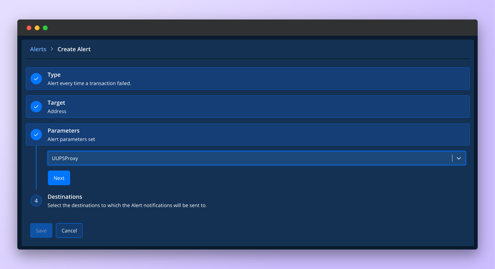<figcaption>
Parameters for the Failed Transaction Alert
</figcaption></figure>

The Failed Transaction alert sends a notification when a transaction fails to get added to the blockchain. This alert is commonly used for early detection of usage issues for wallets, smart contracts, and dapps.

To create a Failed Transaction alert, complete the following steps:

1. **Select Failed Transaction** from the list of Alert Types.
2. From the Target section, **select Address** to monitor a single address.
3. **Choose the address of the smart contract** from the dropdown.
4. [**Set the Destination**](configuring-alert-destinations/) by creating a new one or select one you previously created.
5. **Click Save** to get notified when a transaction fails.

## Function Call

<figure>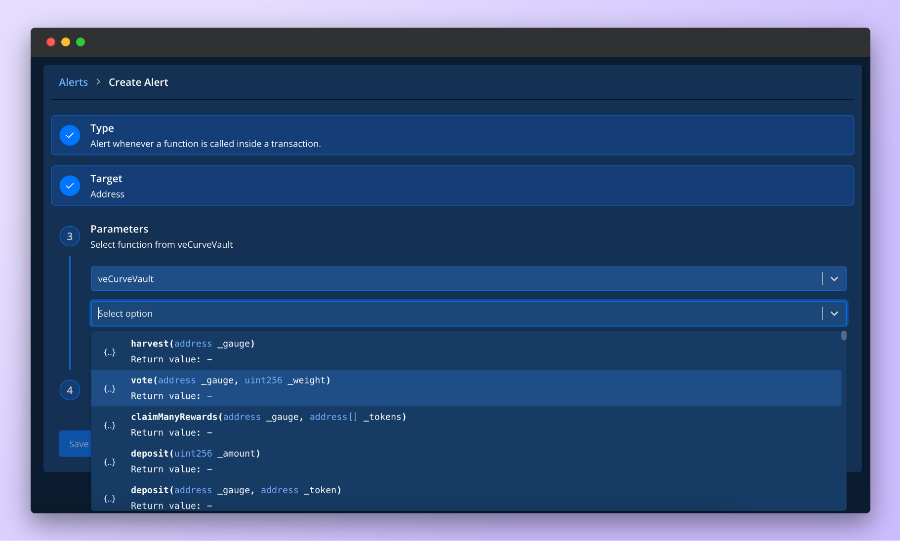<figcaption>
Parameters for the Function Call Alert
</figcaption></figure>

The Function Call alert sends a notification when a specific function is called from a selected smart contract. Notifications will be sent when the function is first called in a transaction, and each time it's called during the execution via internal calls.

To create a Function Call alert, complete the following steps:

1. **Select Function Call** from the list of Alert Types.
2. From the Target section, **select Address** to monitor a smart contract deployed on a specific address.
3. **Choose the address of the smart contract** from the dropdown.
4. **Select the function** you want to monitor. Tenderly will extract all available functions from the smart contract.
5. [**Set the Destination**](configuring-alert-destinations/) by creating a new one or select one you previously created.
6. **Click Save** to get notified when the function gets called from your smart contract.

## Event Emitted

<figure>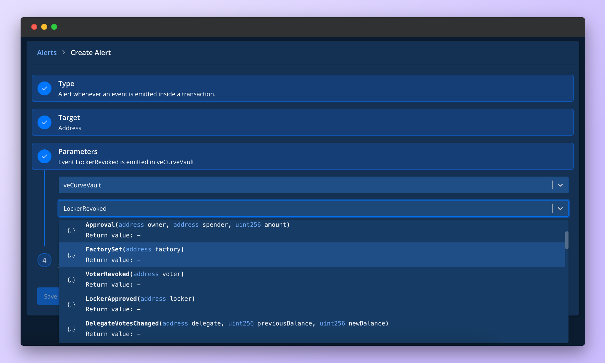<figcaption>
Parameters for the Event Emitted Alert
</figcaption></figure>

The Event Emitted alert sends a notification when a specific event is emitted from the selected smart contract. For example, you can use this alert to monitor an ERC-20 token and get notified when a third-party address is approved to spend the balance.

To create an Event Emitted alert, complete the following steps:

1. **Select Event Emitted** from the list of Alert Types.
2. From the Target section, **select Address** to monitor a smart contract deployed on a specific address.
3. **Choose the address of the smart contract** from the dropdown.
4. **Select the event function** you want to monitor from the list of available events.
5. [**Set the Destination**](configuring-alert-destinations/) by creating a new one or select one you previously created.
6. **Click Save** to get notified when the event function emits an event.

## Event Parameter

<figure>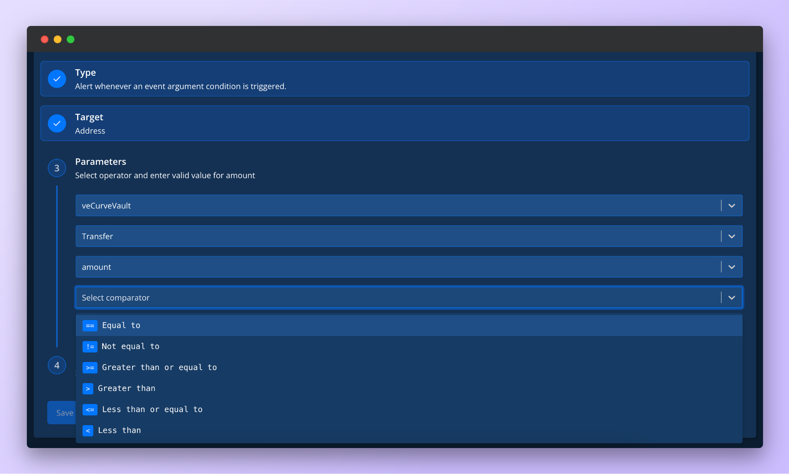<figcaption>
Parameters for the Event Parameter Alert
</figcaption></figure>

The Event Parameter alert sends a notification when an event argument matches the set conditions. For example, you can use this alert to monitor an ERC-20 token and get notified when a third-party address is approved to spend a balance higher than the threshold value.

To create an Event Parameter alert, complete the following steps:

1. **Select Event Parameter** from the list of Alert Types.
2. From the Target section, **select Address** to monitor a smart contract deployed on a specific address.
3. **Choose the address of the smart contract** from the dropdown.
4. **Select the event function** you want to monitor from the list of available events.
5. **Choose the argument** from the list of arguments that the selected event function requires. Some events can have multiple arguments. Tenderly will pull in all the required arguments automatically.
6. **Select the comparator operator** (e.g., equal to, not equal to, etc.).
7. **Enter the comparison value** (e.g., integer, address, etc.) you want to compare the argument value against.
8. [**Set the Destination**](configuring-alert-destinations/) by creating a new one or select one you previously created.
9. **Click Save** to get notified when the argument in the event function matches the conditions you defined.

## ERC20 Token Transfer

<figure>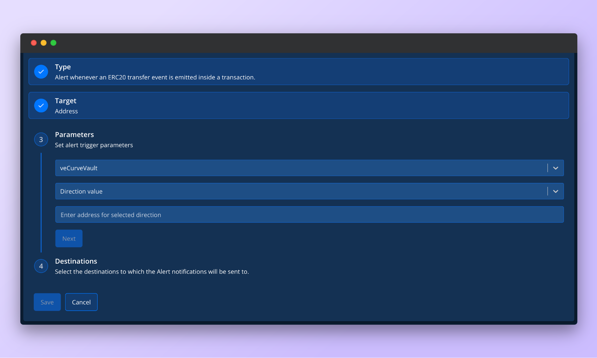<figcaption>
Parameters for the ERC20 Token Transfer Alert
</figcaption></figure>

The ERC20 Token Transfer will send you a notification when an ERC-20 transfer event is emitted from a smart contract. This alert is useful when you want to keep track of token transfers from one address to another.

To create an ERC-20 Token Transfer alert, complete the following steps:

1. **Select ERC20 Token Transfer** from the list of Alert Types.
2. From the Target section, **select Address** to monitor a smart contract deployed on a specific address.
3. **Choose the address of the smart contract** from the dropdown.
4. **Set the directional value** — tokens **coming to** or **going from** the selected address.
5. **Enter the address** that corresponds to the directional value.
6. [**Set the Destination** ](configuring-alert-destinations/)by creating a new one or select one you previously created.
7. **Click Save** to get notified when an ERC-20 token transfer event occurs.

## Allowlisted Callers

<figure>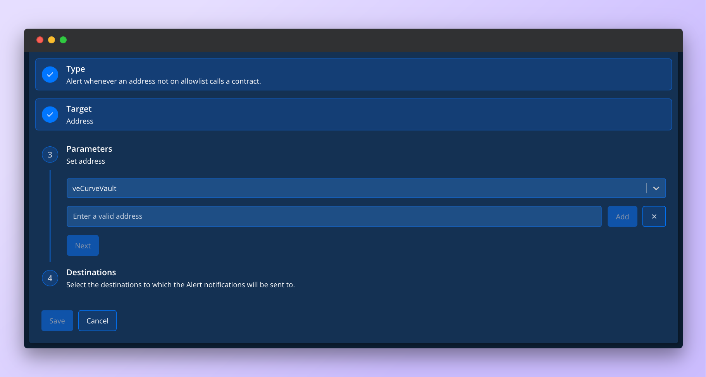<figcaption>
Parameters for the Allowlisted Alert
</figcaption></figure>

The Allowlisted Callers alert allows you to add familiar addresses and receive notifications only when addresses that are not on the list call a smart contract.

To create an Allowlisted Callers alert, complete the following steps:

1. **Select Allowlisted Callers f**rom the list of Alert Types.
2. From the Target section, **select Address** to monitor a smart contract deployed on a specific address.
3. **Choose the address of the smart contract** from the dropdown.
4. **Enter the address(es)** you are familiar with and want to exclude from monitoring.
5. [**Set the Destination**](configuring-alert-destinations/) by creating a new one or select one you previously created.
6. **Click Save** to get notified when someone outside the list of addresses you created calls your smart contract.

## Blocklisted Callers

<figure>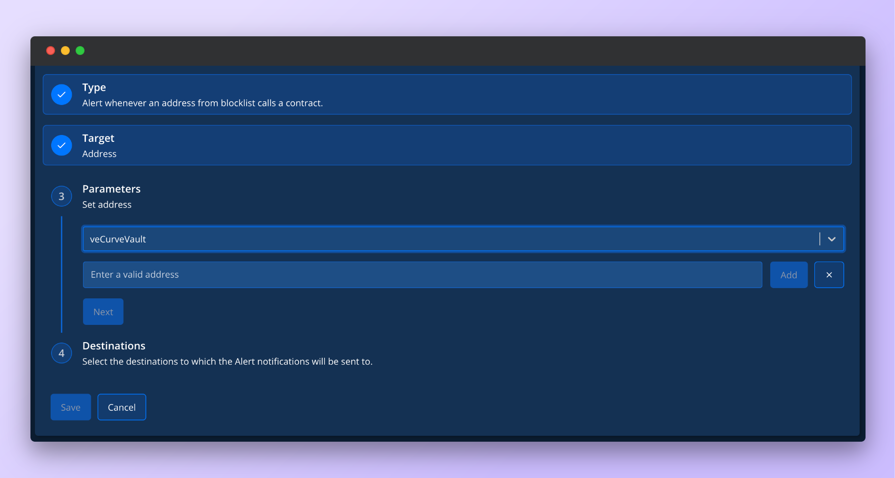<figcaption>
Parameters for the Blocklisted Alert
</figcaption></figure>

The Blocklisted Caller alert allows you to add unwanted addresses and only receive a notification when those addresses send a transaction to the selected Target. This alert can be used to monitor when unauthorized addresses try to call your multisig wallet or contract.

To create a Blocklisted Callers alert, complete the following steps:

1. **Select Blocklisted Callers** from the list of Alert Types.
2. From the Target section, **select Address** to monitor a smart contract or wallet deployed on a specific address.
3. **Choose the address of the smart contract** from the dropdown.
4. **Enter the address(es)** you want to keep an eye on and get notified when they take action on your smart contract or wallet.
5. [**Set the Destination**](configuring-alert-destinations/) by creating a new one or select one you previously created.
6. **Click Save** to get notified when someone on the list of addresses you created calls your smart contract.

## ETH Balance

<figure>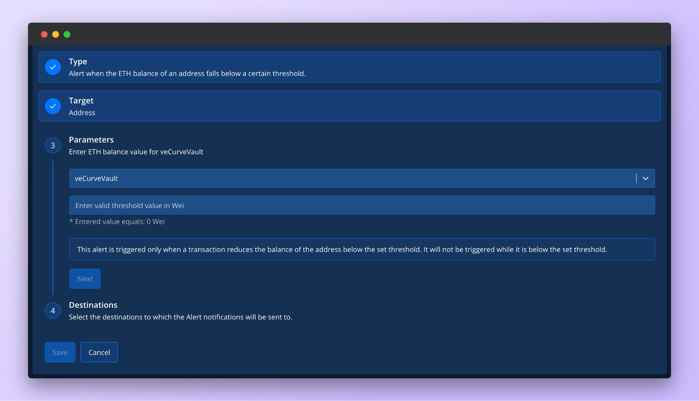<figcaption>
Parameters for the ETH Balance Alert
</figcaption></figure>

The ETH Balance alert notifies when the ETH balance of a specific address falls below a certain amount after a transaction is executed. This alert can be useful to know when you need to top up your wallet (like bots or keepers).

To create an ETH Balance alert, complete the following steps:

1. **Select ETH Balance** from the list of Alert Types.
2. From the Target section, **select Address** to monitor a smart contract or wallet deployed on a specific address.
3. **Choose the address of the smart contract or wallet** from the dropdown.
4. **Set the balance threshold value in Wei.** Note that you will get notified only when the balance falls below the set threshold. You won’t receive further notifications if the balance remains below the threshold.
5. [**Set the Destination**](configuring-alert-destinations/) by creating a new one or select one you previously created.
6. **Click Save** to get notified when the ETH balance on your smart contract or wallet falls below the threshold you defined.

## Transaction Value

<figure>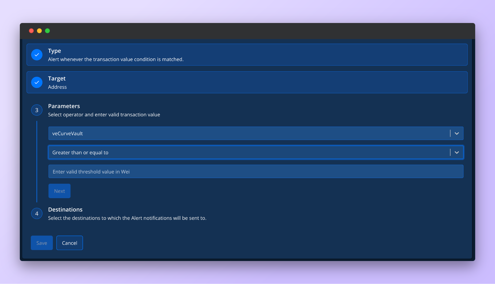<figcaption>
Parameters for the Transaction Value Alert
</figcaption></figure>

The Transaction Value alert notifies you when the value of a transaction involving a wallet or smart contract matches some value in Wei.

To create a Transaction Value alert, complete the following steps:

1. **Select Transaction Value** from the list of Alert Types.
2. From the Target section, **select Address** to monitor a smart contract or wallet deployed on a specific address.
3. **Select the comparator operator** (e.g., equal to, greater than, etc.).
4. **Enter the value in Wei** that you want to compare against.
5. [**Set the Destination**](configuring-alert-destinations/) by creating a new one or select one you previously created.
6. **Click Save** to get notified when the value of a transaction coming from the wallet or smart contract matches the value in Wei you specified.

## State Change

<figure>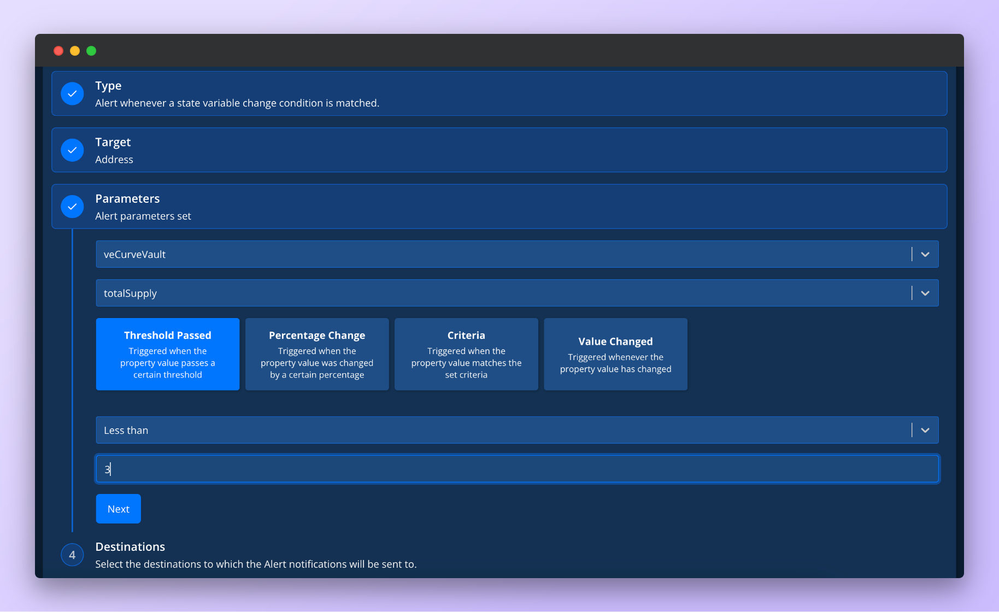<figcaption>
Parameters for the State Change Alert
</figcaption></figure>

The State Change alert notifies you when a numeric (int/uint) state variable in a smart contract is changed. With this alert, you can get notifications when the number of required confirmations in a multisig increases or decreases. Similarly, you can observe any other configuration-like state variable of a smart contract.

To create a State Change alert, complete the following steps:

1. **Select State Change** from the list of Alert Types.
2. From the Target section, **select Address** to monitor a smart contract or wallet deployed on a specific address.
3. **Select the state variable** from the smart contract that you want to monitor.
4. **Configure additional parameters** for the selected state variable. Depending on the data type of the state variable, you need to configure additional parameters to tell Tenderly how to compare the property value of the state variable to what you want:
   * **Threshold passed:** Triggers when the property value passes a threshold. You’ll get only one alert each time the value passes the threshold.
   * **Percentage change:** Triggers when the property value increases or decreases by a percentage you set.
   * **Criteria:** Triggers when the new property value set by a transaction matches the comparison criteria.
   * **Value changed:** Triggers the alert whenever the property value changes.
5. [**Set the Destination**](configuring-alert-destinations/) by creating a new one or select one you previously created.
6. **Click Save** to get notified when the state variable in the smart contract changes.

## View Function

<figure>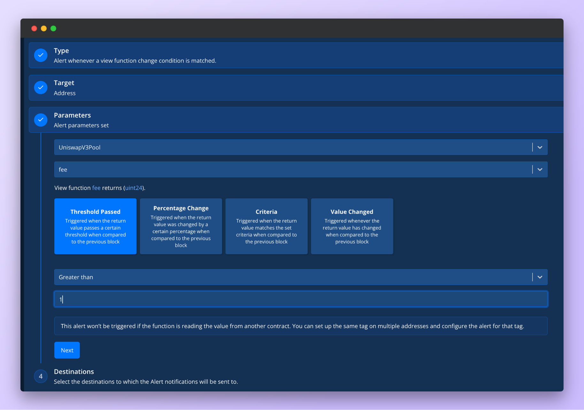<figcaption>
Parameters for the View Function Alert
</figcaption></figure>

The View Function alert notifies you when the return value of a selected `view` function in a smart contract is changed by a transaction. For example, you can track when the balance of a particular address of an ERC-20 token changes by using the `balanceOf('0x...')` view function.

To create a View Function alert, complete the following steps:

1. **Select View Function** from the list of Alert Types.
2. From the Target section, **select Address** to monitor a smart contract or wallet deployed on a specific address.
3. **Choose the smart contract address.**
4. From the list of declared view functions, **select the view function** that you want to monitor. You will have to specify any arguments view function may require.
5. **Configure additional parameters** depending on the data type returned by the view function.
   1. **Threshold passed:** Define the threshold and get alerted when the return value passes the threshold value. You also need to define the comparator type (less than, equal to, etc.) and the value with which to make the comparison. You’ll get only one alert each time the value passes the threshold.
   2. **Percentage change:** Define the percentage and get alerted when the changes by a certain percentage. You also need to define the comparator type and the value with which to make the comparison.
   3. **Criteria:** Define any type of criteria that you want using the different comparator operators and get notified when the criteria are met.
   4. **Value changed:** Get notified whenever the return value changes in any way.
6. [**Set the Destination**](configuring-alert-destinations/) by creating a new one or select one you previously created.
7. **Click Save** to get notified when the return value of a view function you selected changes compared to the previous block.
