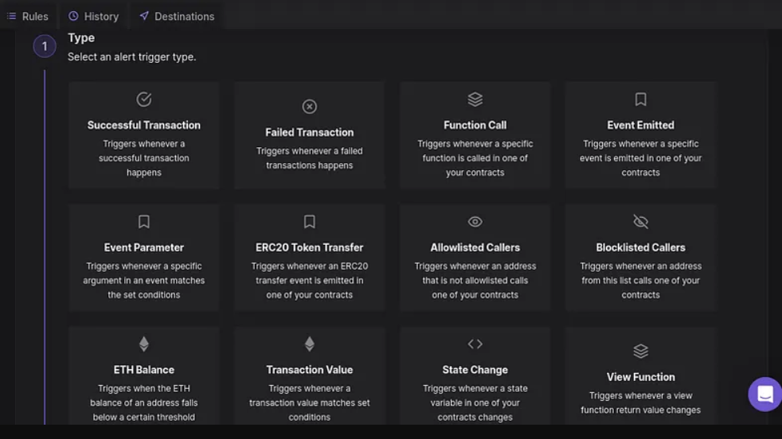
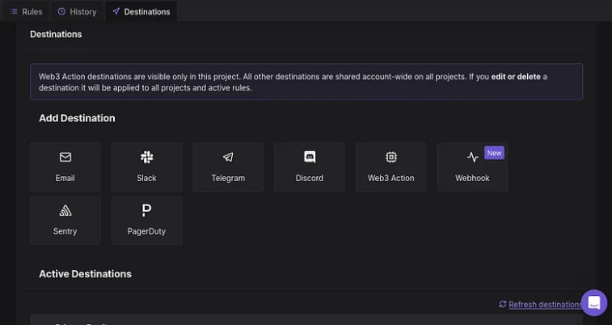
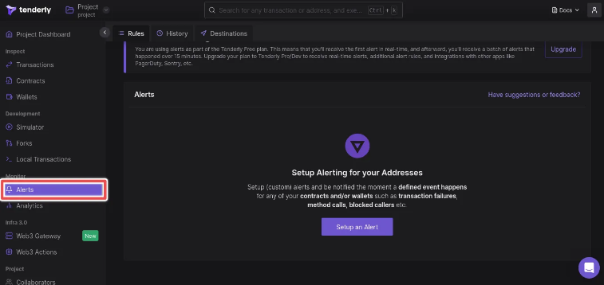
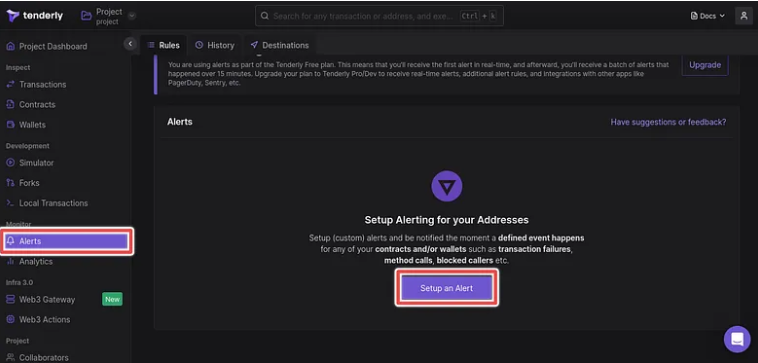
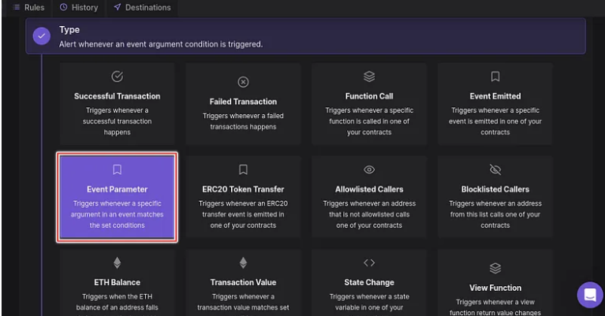
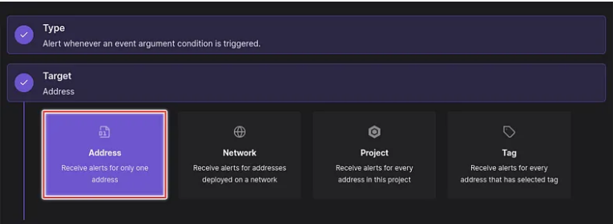
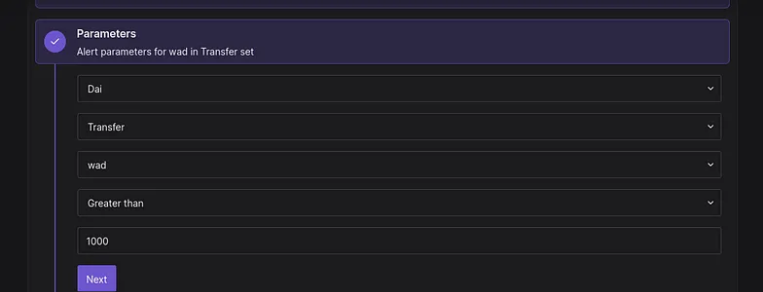
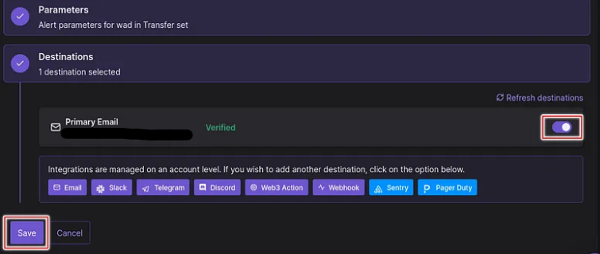
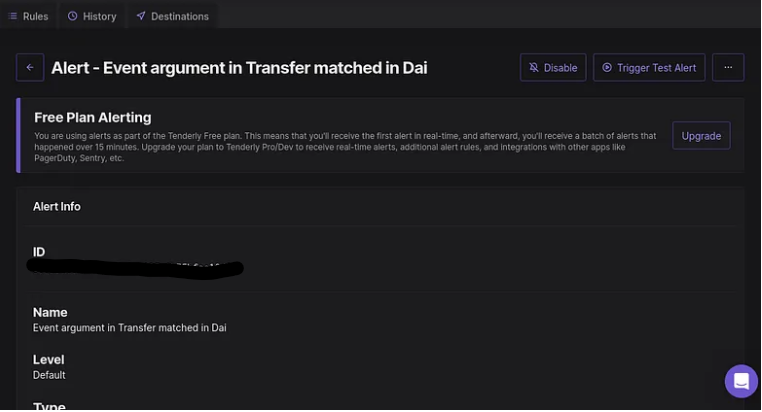

# Tenderly Alert: A Tool for Smart Contract and Wallet Monitoring

As the world of blockchain technology and decentralized finance (DeFi) expands rapidly, the incidents of hacking and rug-pulling have also increased exponentially, causing many to lose their fortunes. Although the blockchain is open for anyone to track their favorite dApp smart contract or wallet, Tenderly Alert provides a solution for this issue. By enabling users to listen to on-chain events and receive notifications via various supported destinations, Tenderly Alert ensures that users can stay up-to-date with the latest developments in their smart contracts or wallets.

## Prerequisite

* A [Tenderly](https://dashboard.tenderly.co/register) account.
* Add Dai stable coin (DAI) to smart contract on Tenderly Dashboard.

## What is Tenderly Alert?

Tenderly Alert is a monitoring solution designed for smart contracts and wallets, which permits users to monitor on-chain events and receive notifications through various channels, including email, Slack, webhooks, Sentry, PagerDuty, and more.

## What Type of On-chain Event Can I Listen to?

As of the time of writing Tenderly Alert supports various on-chain events called **alert trigger type** such as:
- Successful Transaction
- Failed Transaction
- Function Call
- Event Emitted
- Event Parameter
- ERC20 Token Transfer
- State Change etc.

## What are the Destinations Supported?

At present, Tenderly Alert facilitates notifications via several channels, including Email, Slack, Telegram, Discord, and other monitoring solutions like Sentry and PagerDuty. By default, the Primary Email used during registration on Tenderly is set as the Active Destination for notifications.

## Let Monitor DAI Smart Contract

DAI is a stablecoin built on the Ethereum blockchain, which aims to maintain a value as close to one United States dollar as possible. I have added the Smart Contract address for DAI to my list of contracts. Now, we can proceed to create our initial alert to monitor any transfers made on DAI that exceed a value of 1000.

1. **click on Alerts by the left menu bar under Monitoring.**

2. **In the Rules tab click on Setup an Alert button**

3. **In Alert Type Select Event Parameter**

4. **Under Target, select Address**

5. **Under Parameters:** Parameters are broken down into:

* Choose the smart contract to be monitored: In this case, we will choose DAI as the smart contract.
* Choose the Method: Methods are functions defined in a smart contract. For this example, we will select the Transfer method.
* Choose the Argument: Depending on the method, there may or may not be an argument required. we will **wad**.
* Select a Comparison: There are several comparison options available such as Equal to, Not Equal to, Greater than, etc.
* Set the Comparison Value: This is the value that you want to use as a benchmark. In this case, we want to be notified for every transfer of DAI that is greater than 1000.

6. **Destination:** we will be using email, which can be set by switching it on. click on save when done.

7. **Congratulations:** once save you will be redirected to the newly created alert with all the information about the alert, with options to Duplicate the Alert, Edit or Remove.

## The benefit of Using Tenderly Alert to Monitor Smart Contracts and Wallets

* Detect and resolve issues with smart contracts
* Identify and address potential operational and security problems in advance
* Detect any unusual or suspicious activity on account wallets
* Utilize Tenderly Action to proactively prevent hacks when any suspicious behavior is detected.