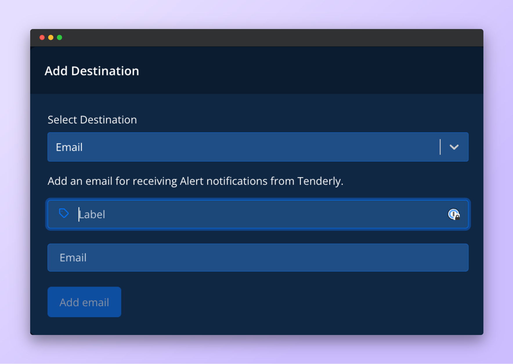
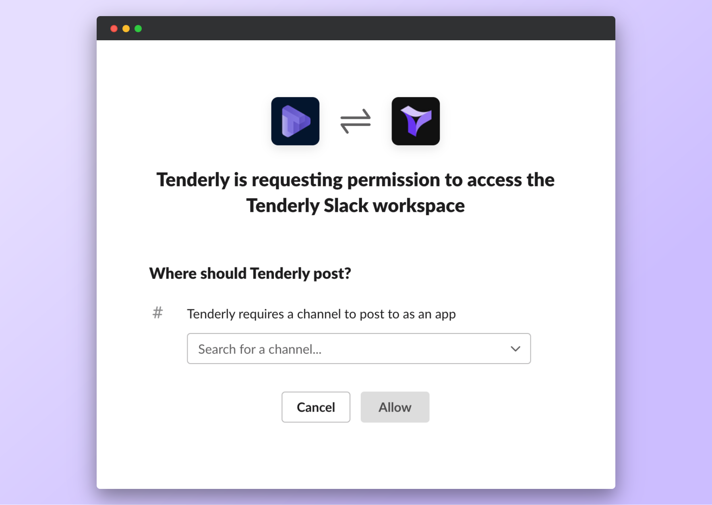
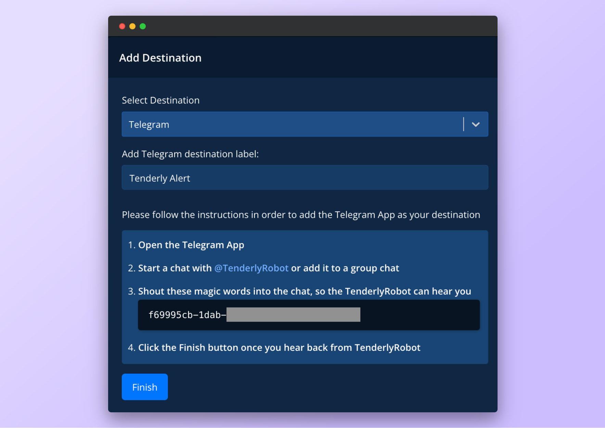
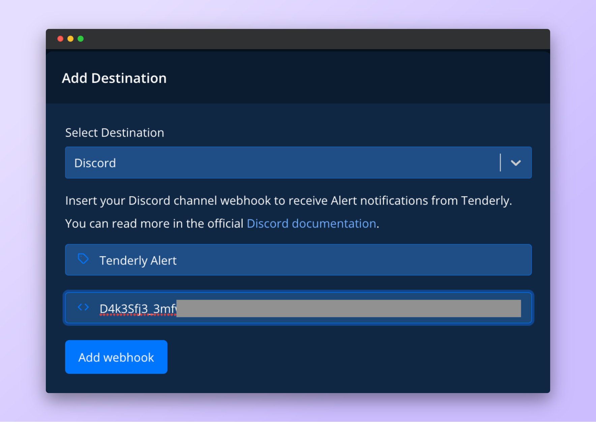
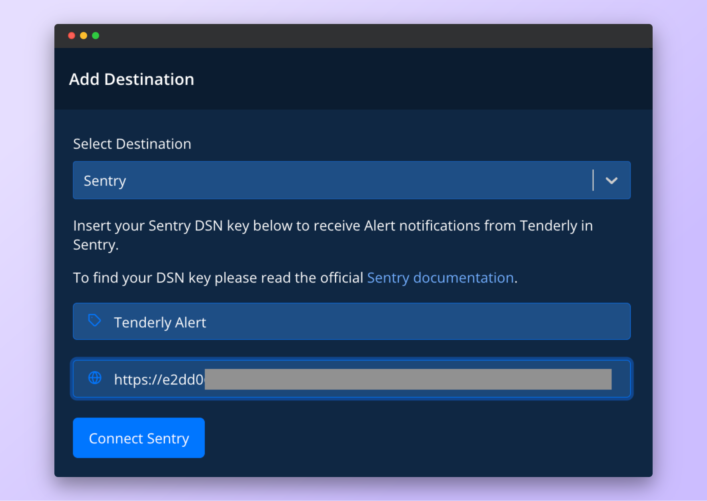
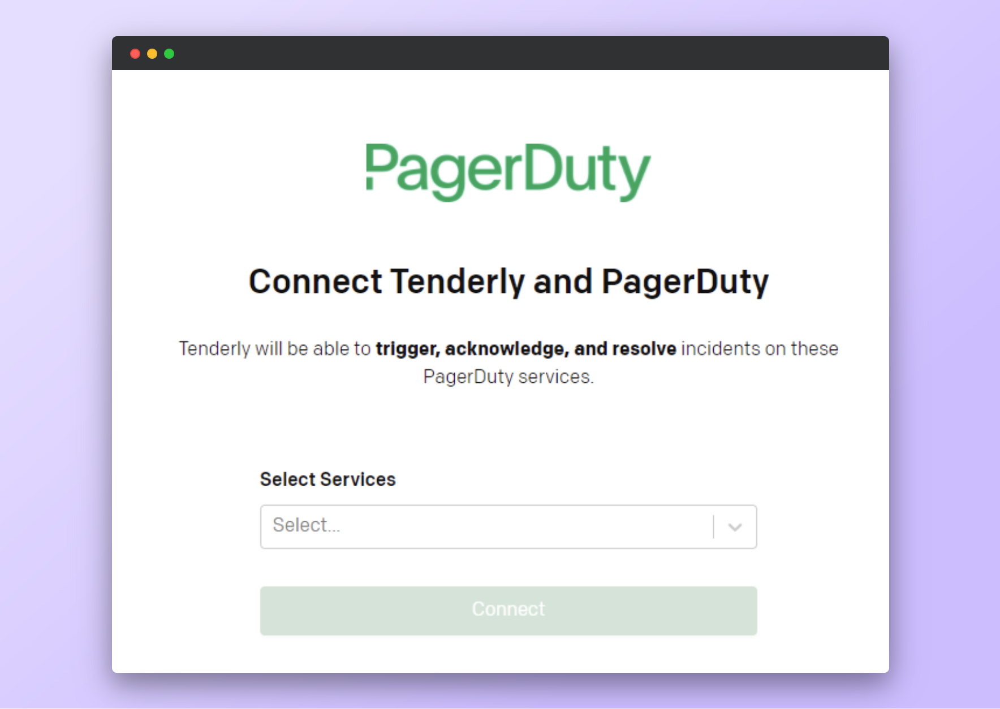

# Account-Scoped

Account-scoped Destinations are accessible across all your projects within your Tenderly account.

### Email Destination

<figure><figcaption>
Email destination configurations
</figcaption></figure>

Get an Alert notification in your email inbox.

Go to **Alerts →** **Destinations → Email.**

**Click Add Email.**

A verification email will be sent to the email address you provided. Click the link in the email to confirm that you’re the owner of the email address.

### Slack Destination

<figure><figcaption>
Slack destination configurations
</figcaption></figure>

Get Alert notifications in a private message or a channel on Slack.

Go to **Alerts →** **Destinations → Slack → Connect Slack.**

This will take you to the Slack permissions screen, where you need to set the Slack channel or private message to receive notifications.

### Telegram Destination

<figure><figcaption>
Telegram destination configurations
</figcaption></figure>

Get Alert notifications in a Telegram channel.

Go to **Alerts →** **Destinations → Telegram.**

Add a required label for the Telegram Destination and click Next.

**Follow the instruction** on the screen to connect to TenderlyRobot for Telegram and **click Finish**.

### Discord Destination

<figure><figcaption>
Discord destination configurations
</figcaption></figure>

Get Alert notifications in a Discord channel.

Go to **Alerts →** **Destinations → Discord.**

Add a required label and paste your Discord webhook. Follow this [official guide from Discord](https://support.discord.com/hc/en-us/articles/228383668-Intro-to-Webhooks) to get the webhook URL.

**Click Add Webhook**.

### Sentry Destination

<figure><figcaption>
Sentry destination configurations
</figcaption></figure>

Send Alert data to Sentry, a third-party application alert monitoring and error tracking platform.

Go to **Alerts →** **Destinations → Sentry.**

Add a required label and paste the Sentry DSN key. Check the [official Sentry documentation](https://docs.sentry.io/product/sentry-basics/dsn-explainer/) to learn how to find your project DSN.

**Click Connect Sentry**.

### PagerDuty Destination

<figure><figcaption>
PagerDuty destination configurations
</figcaption></figure>

Send Alert data to PageryDuty, a third-party incident response platform.

Go to **Alerts →** **Destinations → PagerDury → Connect PagerDuty.**

You'll get redirected to a PagerDuty page and asked to add the Tenderly PagerDuty App to your workspace and authorize a specific channel to receive Alert notifications.
