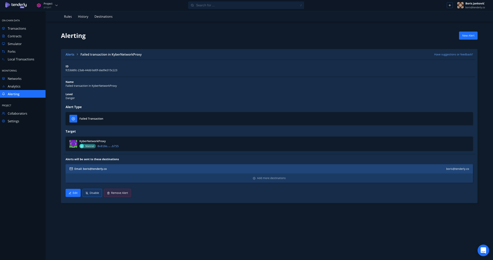

# Editing an Alert

When creating an Alert, it will automatically have a default Alert Level and an empty description. You can update these details by editing the existing Alert.

To make further adjustments, go to the Alerting tab and choose the Alert you want to edit. Click the preferred Alert for more details:&#x20;

Next, click the Edit button, which will open the Edit Alert screen. Here, you can change the Alert Level, Name, and Description and add or remove Alert Destinations.
