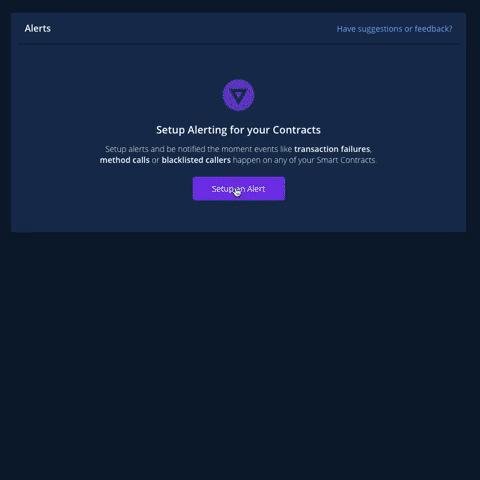

# Failed Transaction

#### Introduction

Trigger your alert whenever a transaction that calls my Smart Contracts failed. You can set up different targets like when a transaction calls some contract, or more general like when the transaction is created on some network.

#### Example 1

Let’s say we have deployed some contracts and want to monitor every failed transaction that calls our contract.

* First of all, we need to add that contract to Project. You can see here how to **\[Add new contract\]** into Project.

* Click on **Alerting** in the navigation **—&gt;** **New Alert** **—&gt;** **Failed Transaction —&gt; Contract —&gt; Select Contract —&gt;** Find Contract you want to monitor and Choose it **—&gt; Next —&gt;** Choose Alert Destination **—&gt; Save.** 
* That is it, Alert was created. Now if a transaction ever fails, I get notified instantly. 
* When Alert was created if we want to add a description, alert level, more alert destinations, or change the name, we can do that. You can see how in [Edit Alert](editing-an-alert.md).

#### Example 2

For this example, we created an alert that will notify us whenever a transaction fails on the DAI Smart Contract. After setting up the alert we need to choose a destination:

Here we’ll select our shiny new Sentry and PagerDuty destinations.

Now, whenever a Dai transaction fails, a man will come and tap you on the shoulder to inform you about it. Not really, but instead of that, you will have to settle for a detailed alert from Sentry and PagerDuty.

As you can see, the whole error stack-trace can be found on your Sentry dashboard:

PagerDuty gives you a more straightforward insight into the issue:

