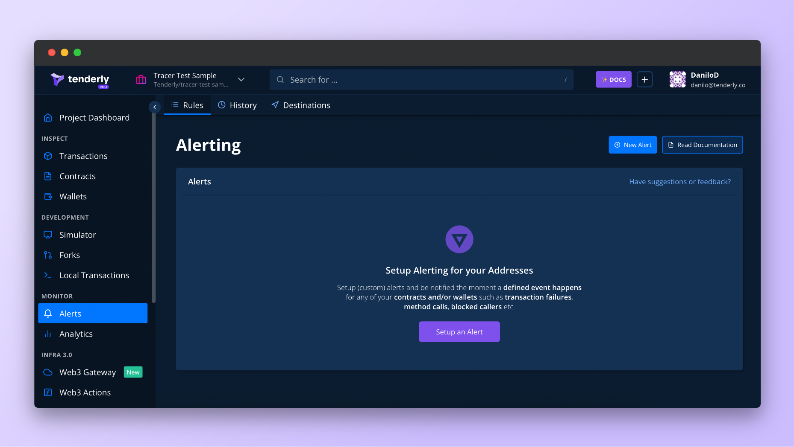
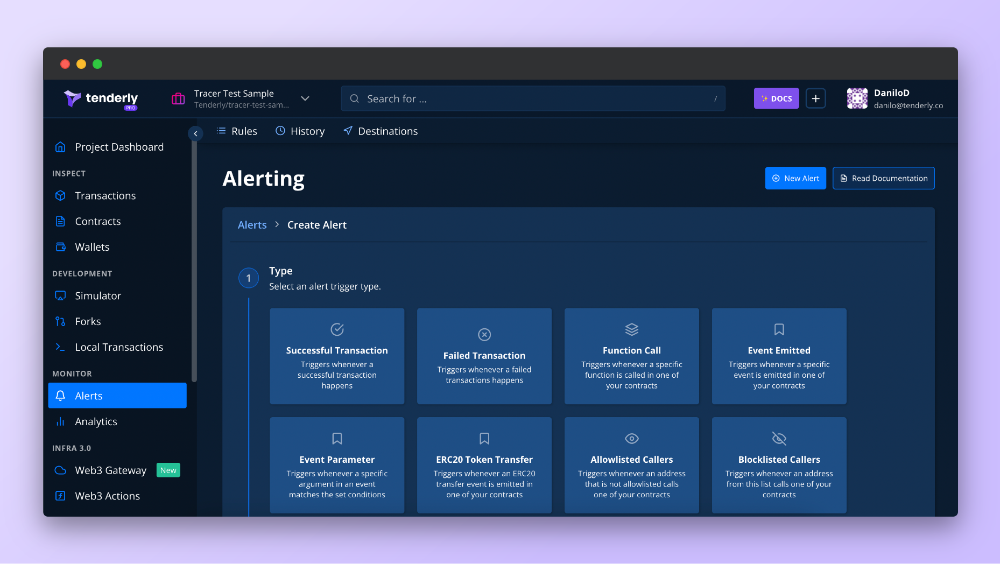
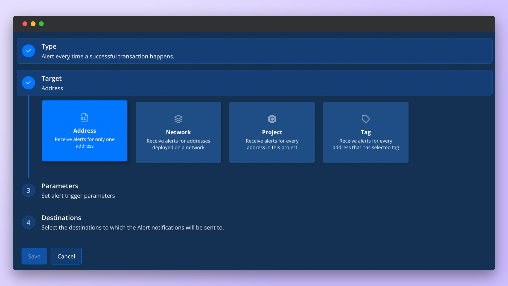
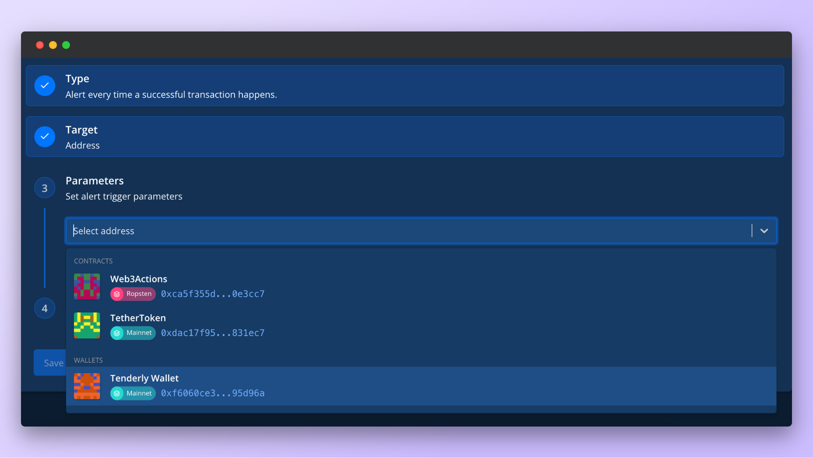
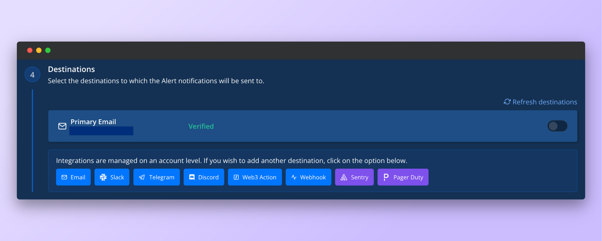
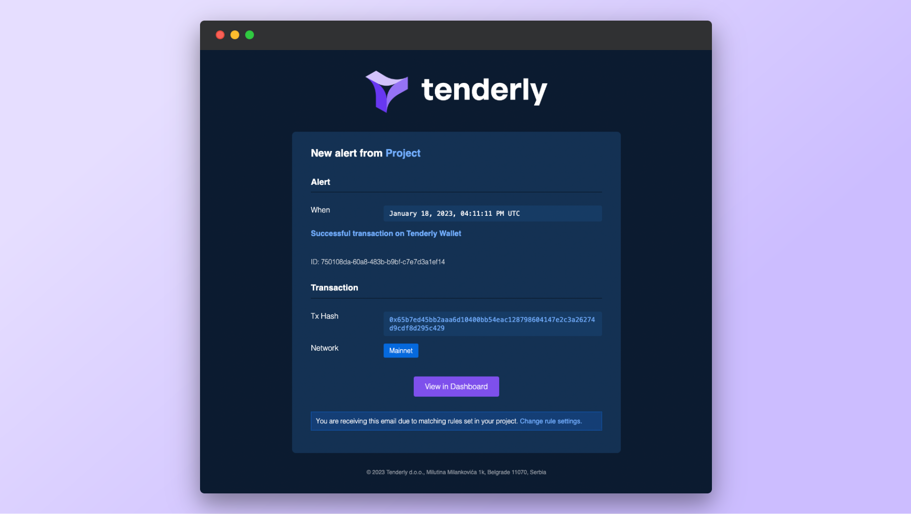
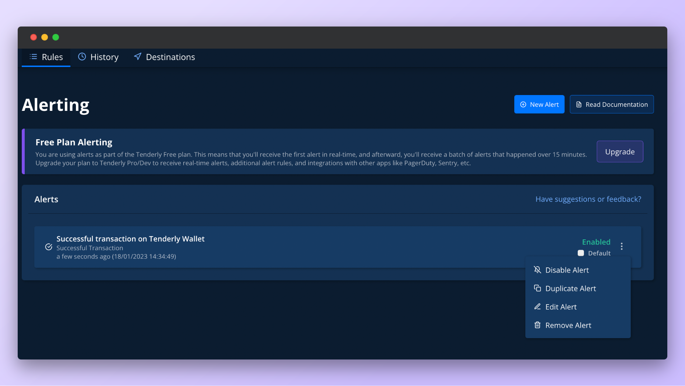
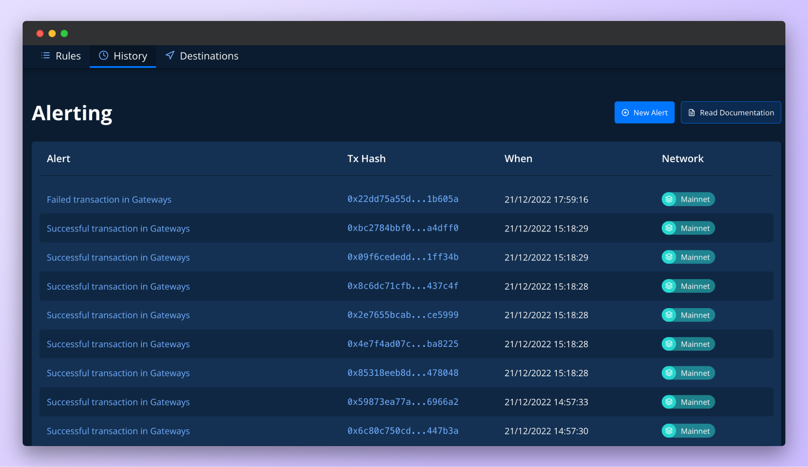
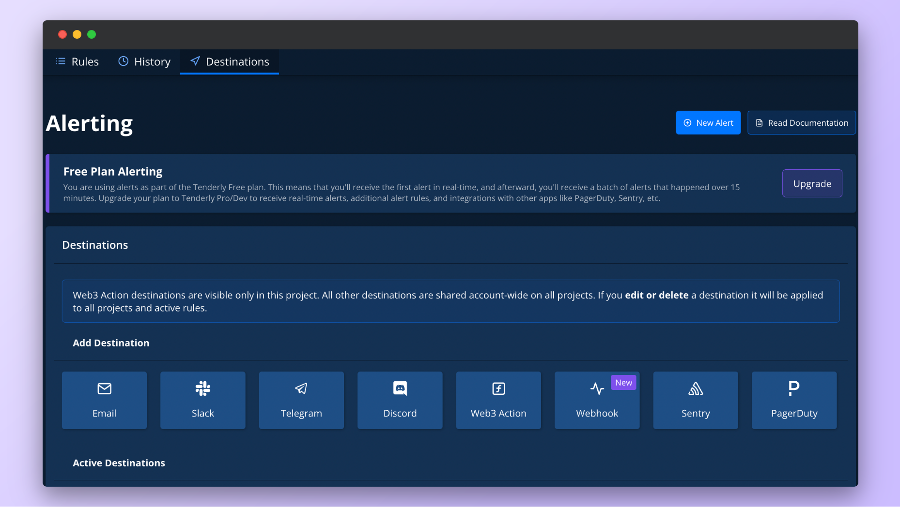

# Alerting Quickstart Guide

This quick start guide shows you how to configure a Successful Transaction alert to send a notification about successful transactions coming to and from a wallet.

## Step 1: Launch the Alerts setup wizard

<figure><figcaption>
Alerts landing page
</figcaption></figure>

From the left-hand menu, **click on Alerts** to launch the Alerts setup. From here, you can create new Alerts or manage existing ones.

To create a new Alert, **click the** **New Alert** **button**, which will open up the Alert configuration settings.

<figure><figcaption>
Alert set up wizard
</figcaption></figure>

To set up a Successful Transaction alert or any other alert, you need to configure four components:

* **Alert Type:** The event you want the Alert to listen for and send you a notification when it happens. Tenderly supports [12 Alert Types](../alert-types-targets-and-parameters.md).
* **Alert Target:** Here, you tell Tenderly which addresses you want to monitor. The Target options are the same across all Alert Types.
* **Alert Parameters:** Based on the Target, this is where you select the specific address(es) you want to monitor along with other settings specific to the Alert Type.
* **Alert Destinations:** Location where you want to receive notifications when the event occurs.

## Step 2: Choose the Successful Transaction Alert Type

From the list of available Alert Types, **select Successful Transaction** to monitor when a successful transaction happens.

<figure><figcaption>
Available Alert trigger types
</figcaption></figure>


Some Alert Types are self-explanatory, while others are more nuanced, so please refer to the [Alert Trigger Types documentation](../alert-types-targets-and-parameters.md) page for detailed explanations of each.


## Step 3: Set the Alert Target to Address

The Alert Target section is where you tell Tenderly which address(es) you’d like to monitor and where they are located.

The available Target options are the same for all Alert Types and include:

* **Address:** Monitor a single smart contract or wallet
* **Network:** Monitor all transactions on a specific network
* **Project:** Monitor all addresses that are part of your Tenderly Project
* **Tag:** Monitor all contracts and wallets labeled with the specific tag

In our case, we’ll **choose Address** because we want to monitor a single address of our wallet.

<figure><figcaption>
Available Alert Targets
</figcaption></figure>

## Step 4: Set the wallet address as the Target Parameter

With the Target set to Address, we need to tell Tenderly which wallet address we want to monitor. Tenderly will pull all the smart contracts and wallets associated with your project and display them in a dropdown.


If you haven’t added any smart contracts or wallets to your Tenderly Project, follow these quick guides to learn how to add a [wallet](https://docs.tenderly.co/monitoring/wallets) or a [smart contract](https://docs.tenderly.co/monitoring/smart-contracts).


From the dropdown, we’ll select the address of the Tenderly Wallet.

<figure><figcaption>
List of smart contracts and wallets associated with the project
</figcaption></figure>

## Step 5: Choose Email as the Alert Destination

To keep things simple, we want to receive an email notification informing us about successful transactions coming to and from our Tenderly Wallet.

**Select Email as the Alert Destination** and fill out the required details, including the email address. If you’re adding a new email address, you’ll have to confirm that you’re the owner to be able to receive notifications there.

<figure><figcaption>
Setting Email as the Alert Destination
</figcaption></figure>

When a Successful Transaction event occurs on our wallet, Tenderly will send us an email notification with important information about the event and links to Tenderly Dashboard to inspect it further.

<figure><figcaption>
Email notification from Tenderly
</figcaption></figure>

In addition to [email](../configuring-alert-destinations/account-scoped.md#email-destination), you can also receive notifications in your favorite messaging app:

\*_Click on the link for each destination to learn how to set it up._

* ****[**Slack**](../configuring-alert-destinations/account-scoped.md#slack-destination)****
* ****[**Telegram**](../configuring-alert-destinations/account-scoped.md#telegram-destination)****
* ****[**Discord**](../configuring-alert-destinations/account-scoped.md#discord-destination)****

Or you can send alert data to other Tenderly systems:

* ****[**Web3 Actions**](../configuring-alert-destinations/configuring-alert-destinations.md#web3-actions)****
* ****[**Webhooks**](../configuring-alert-destinations/configuring-alert-destinations.md#webhooks)****

Or third-party incident and error monitoring platforms like:

* ****[**Sentry**](../configuring-alert-destinations/account-scoped.md#sentry-destination)****
* ****[**PagerDuty**](../configuring-alert-destinations/account-scoped.md#pagerduty-destination)****

With the Alert Destination all set, **click Save** to create and enable the Alert.


Notifications from a single Alert can be sent to multiple Destinations. Likewise, you can have multiple Alerts send notifications to a single Destination. Once you add a Destination for the first time, it can be used by Alerts you create in the future.


## Step 6: Managing Alerts and Destinations

All deployed Alerts can be managed from the **Rules** view. Next to the Alert you want to manage, click on the three dots to reveal additional options: **Enable/Disable**, **Duplicate**, **Edit**, or **Remove**.

<figure><figcaption>
Managing an existing Alert
</figcaption></figure>

If you **click on History** in the top menu, you can view when and how many times your Alerts were executed.

<figure><figcaption>
History of Alert execution
</figcaption></figure>

And if you navigate to the **Destinations tab**, you can manage all previously created Destinations or create new ones.

Once you create a Destination, it will be accessible from all your projects, so you don’t have to create the same Destination in another project.

The exception is Web3 Actions as the Alert Destination. This Destination is visible only under the project it was created.

If you **edit or delete** a Destination, the changes will be applied across all your projects and active rules.

<figure><figcaption>
List of created Alert Destinations
</figcaption></figure>

## Wrapping up

In this guide, you learned how to set up and configure a Successful Transaction alert that sends an email notification about all successful transactions coming to and from a wallet.
