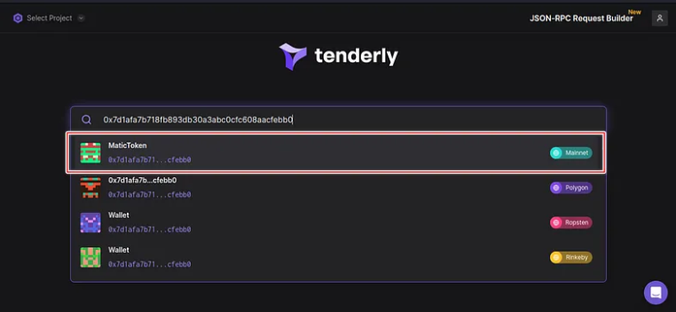

# 🚀 Discover Blockchain Like Never Before with Tenderly Explorer

With the emergence of various blockchains, different explorers have been introduced that offer detailed analytics specific to their blockchain network. This leaves us with the task of using their respective explorers while utilizing their chain. But what if there was a better solution? Fortunately, [Tenderly Explorer](https://dashboard.tenderly.co/explorer) provides a unified blockchain explorer that presents blockchain data in a human-readable format. In this section, we will take a closer look at Tenderly Explorer.

## 🔎 What is Tenderly Explorer?

Tenderly Explorer allows you to access public data about transactions, smart contracts, and addresses on different blockchains that Tenderly supports. With Tenderly Explorer, you can search for all related activities on the blockchain by using a transaction hash (transaction ID), tokens, smart contracts, or wallet addresses. By creating a Tenderly account, you can unlock additional features such as Alerts and Actions, taking your Tenderly Explorer experience to the next level.

## 🚀 Features of Tenderly Explorer:

* 🕰️ History to track recent searches
* 🌎 Support for all the blockchains Tenderly supports
* 🔄 Simulate live pending transactions
* 🔁 Re-stimulate failed and successful transactions
* 🤝 Easily integrate other Tenderly features such as Debugger, Gas Profiler, Alerting, and Actions.

## 🔍 What Are The Blockchains Supported?

As of the time of writing Tenderly support different blockchains ranging from Ethereum Mainnet, Polygon, Binance Smart Chain(BSC), etc.

## 🔎 How to query transactions and wallet addresses on Tenderly Explorer?

One of the features of Tenderly Explorer is tracking transactions. For example, imagine you sent 0.001 ether (ETH) from your wallet to the following public address:

`0xeb99efe01daf2e7ef7ac0eec04eabf63151fb9dc`

After making the transaction, your wallet display this **Transaction ID (TXID)**:

`0x088fa395fff12683e595c677063829edcf7214ebfd82821e9b5b840b9a72daba`

Suppose you want to verify the transaction's number of confirmations and its success status.

1. Go to [Tenderly Explorer](https://dashboard.tenderly.co/explorer) homepage.

2. Copy and paste the transaction ID (TXID) into the search field, and immediately start searching for it, in this example the transaction ID is based on Ethereum Mainnet, once the search is done click on the result.

3. Now you can see all the details regarding your specific transaction: Explore the [transaction](https://dashboard.tenderly.co/tx/mainnet/0x088fa395fff12683e595c677063829edcf7214ebfd82821e9b5b840b9a72daba).

📊 let’s go through just the default display:

| Transaction Hash | 🔍 The string of numbers and letters (TXID) associated with your particular transaction.      |
|------------------|----------------------------------------------------------------------------------------------|
| Network          | 🌐 The Network where the transaction was performed e.g Mainnet, Polygon, Rinkeby, Mumbia      |
| Status           | 🔄 Whether your transaction has failed, is in progress, or was successful.                    |
| Block            | 🧱 The block number your transaction was included in.                                         |
| Index            | 🔢 Integer of the transactions index position in the block.                                   |
| Timestamp        | 🕒 The timestamp of the block your transaction was added to.                                  |
| Nonce            | 🔢 The number of transactions made by the sender prior to this one.                           |
| Value            | 💰 The amount sent in the transaction.                                                        |
| Gas Used         | 🔥 The amount of Gas used in the transaction.                                                 |
| Gas Price        | 💸 The cost per unit of gas for the transaction.                                              |
| Gas Limit        | 🛑 The maximum amount of work set estimating a validator will do on a particular transaction. |
| Transaction Fee  | 💰 The fee paid for making the transaction.                                                   |
| Sender           | 👤 The wallet address that made the transaction.                                              |
| Receiver         | 📨 The receiving address or smart contract.                                                   |

## 🔍 How to look up smart contracts on Tenderly Explorer

Let find out a token address, you can head to CoinMarketCap, CoinGecko, or the project’s official website. You can also check https://etherscan.io/tokens.

Let’s take a look at the MaticToken ERC-20 token on Ethereum:

`0x7d1afa7b718fb893db30a3abc0cfc608aacfebb0`

1. Copy and paste the smart contract address into the search field.

2. You’ll now see details on the contract balance and other general information regarding the [Matic Token contract](https://dashboard.tenderly.co/contract/mainnet/0x7d1afa7b718fb893db30a3abc0cfc608aacfebb0).

3. Underneath, In the Transactions panel let explore a single transaction. In this example we explore transaction ID: 0xf0e0c949b4483b36855f53822fc89a2a47782fc9135451e068ebd2dd6597efcd.

🔍 Analysing a single transaction was explored in my article on "Take Your Smart Contract Development to the Next Level With Tenderly" 💻. In the section, I dive into the features on Tenderly such as Contracts 📝, Events 🎉, State Changes 🔧, Debugger 🐛, Gas Profiler 💸 and Re-simulating transaction 🔄 to help developers take their smart contract development to the next level.

