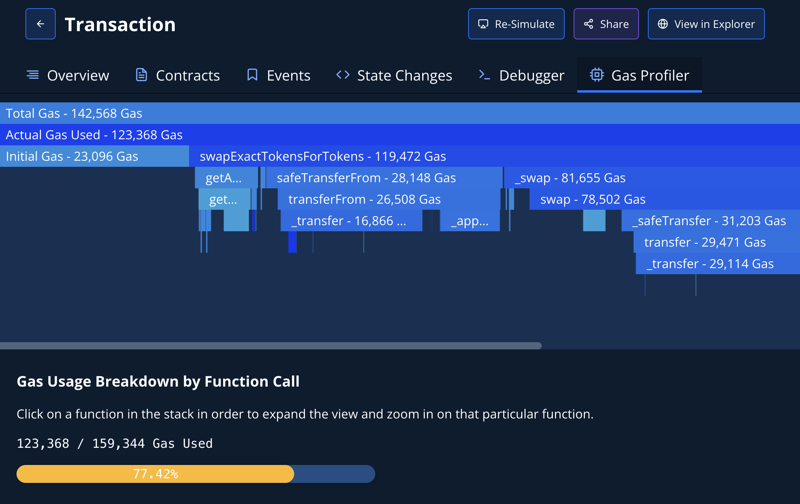
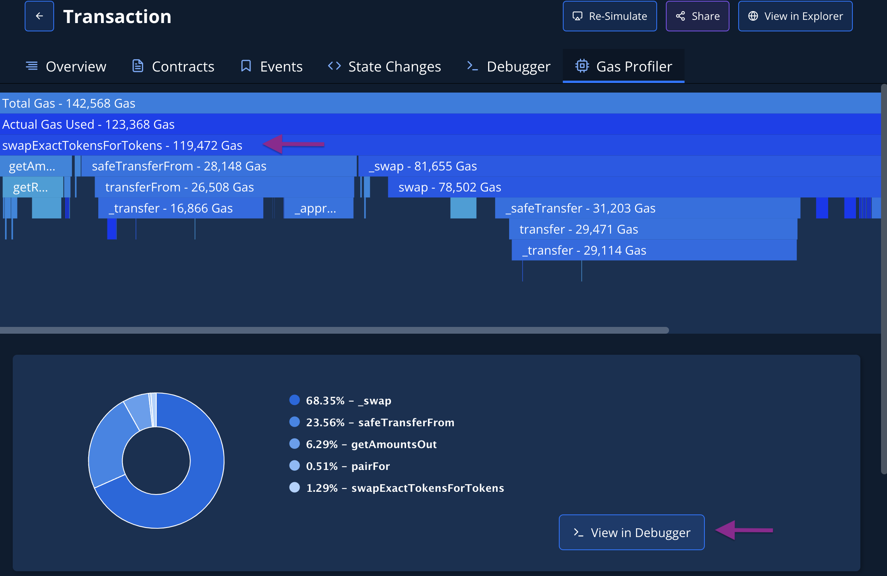

# Gas Profiler

Gas Profiler gives you an in-depth insight into how your smart contract uses gas per function call. It enables you to analyze executed transactions or optimize your code while still in development.

Gas Profiler displays an interactive flame chart and shows gas usage breakdown for each called function, including internal transactions.&#x20;

<figure><figcaption>
Gas usage breakdown in a flame chart
</figcaption></figure>

### Gas optimization

By clicking on a function call in the flame chart, you get details on its gas usage in the lower pane. If you suspect this function is a candidate for gas optimization, click the **View in Debugger** button. You can then jump into the code, analyze it, and find lines of code that you can optimize to reduce gas usage.

To verify that the changes actually help reduce gas usage, you can [simulate the same transaction with the changed code](../simulations-and-forks/how-to-simulate-a-transaction/editing-contract-source.md) and compare the gas profiling result.

<figure><figcaption>
Gas usage within a selected function (swapExactTokensForTokens)
</figcaption></figure>
