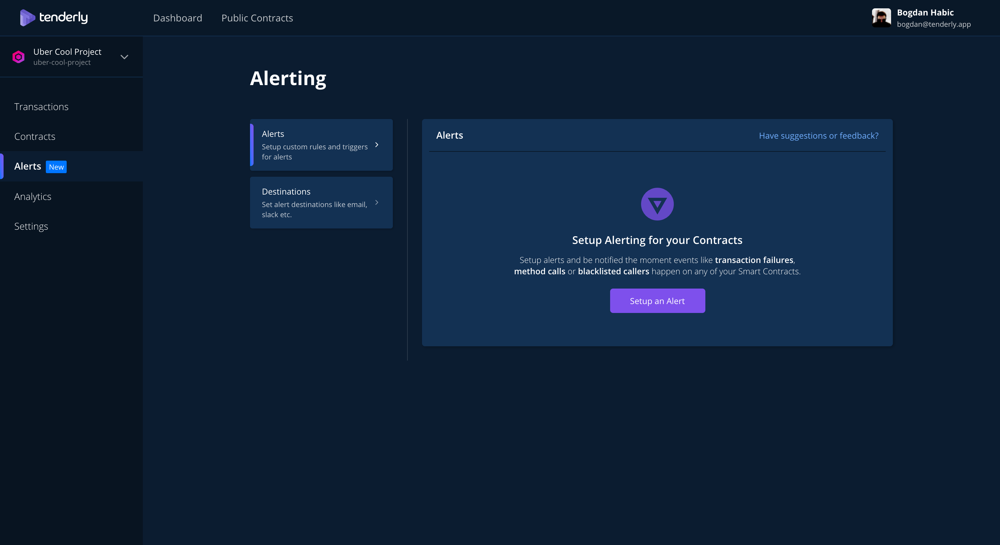
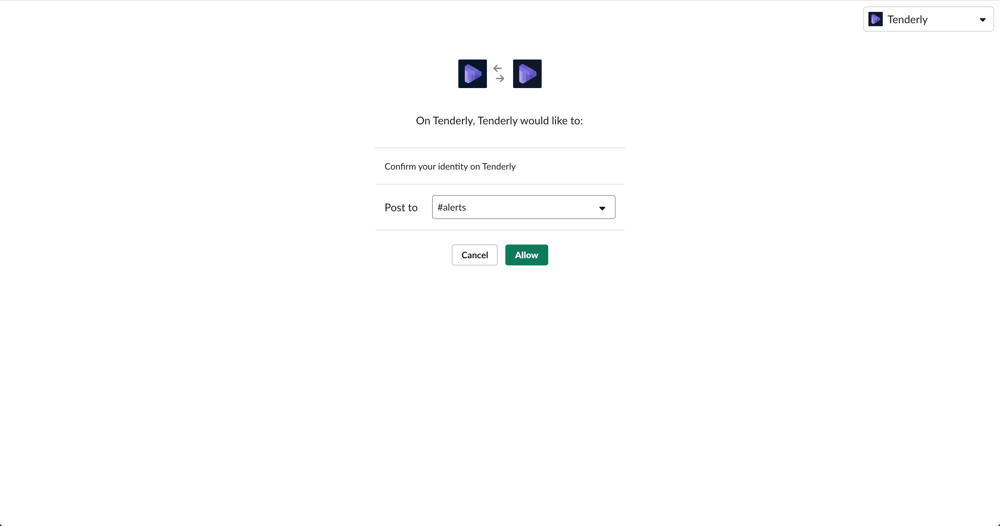
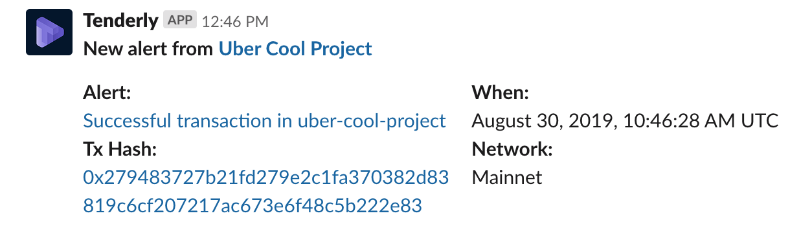

# Slack

You can connect Tenderly with your Slack workspace and get real-time notifications when an alert rule matches a transaction. Connecting multiple channels is also supported so you can route certain rules to specific channels.

## How to connect Slack with Tenderly

Navigate to a project and go to the **Alerts** tab.

Click on **Destinations**.

Finally click on **Slack** and then **Connect Slack**.

You will be greeted with the Slack permissions screen where you will pick to which channel you want your notification to get delivered.

And that's it! Now when a transaction matches a configured alert rule you will get a notification instantly delivered to your Slack channel.

