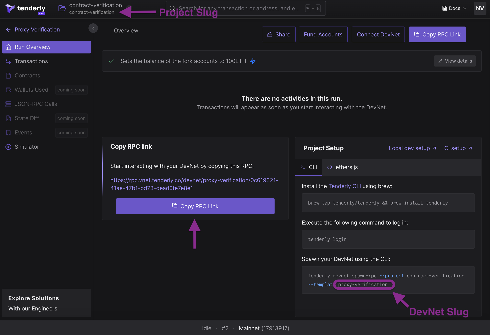

# Verifying Proxy Contracts on Tenderly

When working with proxies, to get full support for transactions debugging, monitoring, and alerting, it's necessary to verify:

* the proxy itself,
* &#x20;the implementation behind the proxy,
* any dependencies the implementation has,
* new implementation instances deployed with upgrades.

<figure><figcaption></figcaption></figure>

Verification process may differ based on the type of proxy you're using and the approach to the implementation.

### Overview

In this guide, we'll be using an [example hardhat project](https://github.com/Tenderly/tenderly-examples), relying on `@tenderly/tenderly-hardhat` plugin to show verification of OpenZepplin's [UUPSUpgradeable](https://docs.openzeppelin.com/contracts/4.x/api/proxy#UUPSUpgradeable), [TransparentUpgradeableProxy](https://docs.openzeppelin.com/contracts/4.x/api/proxy#TransparentUpgradeableProxy), and [BeaconProxy](https://docs.openzeppelin.com/contracts/4.x/api/proxy#BeaconProxy) alternatives.


It's necessary to use the [manual contract verification method](manual-contract-verification.md) when working with proxies.

```typescript
import * as tenderly from "@tenderly/hardhat-tenderly";
// use manual verification
tenderly.setup({ automaticVerifications: false });
```


Additionally, to get the address where the implementation is deployed, we'll need to use `@openzeppelin/upgrades-core` package.

Verification of the proxy implementation is usually quite straightforward: you'd verify it as you would verify any other contract:

```ts
await tenderly.verify({
  // the new implementation contract
  name: "VaultV2",
  // the address where implementation is deployed
  address: await getImplementationAddress(ethers.provider, proxy.address),
});
```

Verification of the proxy instance itself has two prerequisite steps to it:

* [Load the exact smart contract of the proxy](verifying-proxy-contracts-on-tenderly.md#loading-proxy-contracts) so it gets compiled, depending on the type of proxy you're using. To make this happen, we'll need to put the proxy contracts through the compiler by creating a dummy proxy file.
* [Adapt the `hardhat.config.ts`](verifying-proxy-contracts-on-tenderly.md#configuring-solidity-compiler-overrides) to have the exact settings Openzepplin contracts were compiled with.

Having completed this, you can verify the proxy like any other contract:

```ts
await tenderly.verify({
  name: "ERC1967Proxy", // or TransparentUpgradeableProxy or BeaconProxy
  address: proxy.address,
});
```

### Running The Sample

**Step 1:** Run the following commands to clone the repo and install dependencies:

```sh
git clone git@github.com:Tenderly/tenderly-examples.git
cd contract-verification
npm i
```

**Step 2:** Set up [Tenderly CLI](https://github.com/Tenderly/tenderly-cli), using the following command:

```sh
brew tap tenderly/tenderly && brew install tenderly
tenderly login
```

**Step 3:** Modify your `hardhat.config.ts` file and update the `tenderly.username` and `tenderly.project` with your [username and project slug](../../../other/platform-access/how-to-find-the-project-slug-username-and-organization-name.md).

**Step 4:** The fastest way to deploy and verify contracts is to use [Tenderly DevNets](broken-reference). Go to Tenderly dashboard, and create a new DevNet template.&#x20;

<figure><figcaption><p>Project and DevNet Slug</p></figcaption></figure>

**Step 5:** Spawn a DevNet from the template and use the RPC url:

* **Option 1**: Click Spawn DevNet in the dashboard, and copying the RPC link to `networks.tenderly.url` in `hardhat.config.ts`.
* **Option 2**: Run the devnet spawning command you copied from the dashboard and paste the link to `networks.tenderly.url` in `hardhat.config.ts`.
* **Option 3**: Run the `spawn-devnet-to-hardhat` script from the example project, which will spin up a fresh DevNet and update your hardhat project use it automatically. Replace `PROJECT_SLUG` and `DEVNET_TEMPLATE_SLUG` with appropriate values (see the screenshot)

```bash
npm run spawn-devnet-to-hardhat <PROJECT_SLUG> <DEVNET_TEMPLATE_SLUG>
```

**Step 6**: Finally, run the tests:

```sh
rm -rf .openzeppelin &&  npx hardhat test --network tenderly      
```

### Loading Proxy Contracts

In order to verify the proxy contract, create a `DummyProxy.sol`, and import  OpenZepplin's proxy contracts you're using. This way, these contracts are loaded and have passed through compiler, enabling us to reference the exact contract source of the proxy when doing verification.


```sol
// SPDX-License-Identifier: MIT
pragma solidity ^0.8.17;

import "@openzeppelin/contracts/proxy/ERC1967/ERC1967Proxy.sol";
import "@openzeppelin/contracts/proxy/beacon/UpgradeableBeacon.sol";
import "@openzeppelin/contracts/proxy/beacon/BeaconProxy.sol";
import "@openzeppelin/contracts/proxy/transparent/TransparentUpgradeableProxy.sol";

abstract contract ERC1967ProxyAccess is ERC1967Proxy {}
abstract contract UpgradableBeaconAccess is UpgradeableBeacon {}
abstract contract BeaconProxyAccess is BeaconProxy {}
abstract contract TransparentUpgradeableProxyAccess is TransparentUpgradeableProxy {}
```


### Configuring Solidity Compiler Overrides

After compiling Openzepplin's proxy contracts, it's also necessary to indicate the exact:

* version of solidity compiler that was used for the contracts
* optimization settings used by Openzepplin's upgrades plugin when performing proxy deployment/upgrades.

The hardhat-tenderly plugin takes the source code of smart contracts and compiler settings as inputs for the verification process. If any of these two pieces of information are off, verification will fail.

Add the following `overrides` map to `config.solidity` section of your hardhat config object.

```ts
const config: HardhatUserConfig = {
  solidity: {
    compilers: [{ version: "0.8.18" } /* OTHER COMPILER VERSIONS*/],
    overrides: {
      "@openzeppelin/contracts/proxy/ERC1967/ERC1967Proxy.sol": {
        version: "0.8.9",
        settings: {
          optimizer: {
            enabled: true,
            runs: 200,
          },
        },
      },
      "@openzeppelin/contracts/proxy/transparent/TransparentUpgradeableProxy.sol":
        {
          version: "0.8.9",
          settings: {
            optimizer: {
              enabled: true,
              runs: 200,
            },
          },
        },

      "@openzeppelin/contracts/proxy/beacon/UpgradeableBeacon.sol": {
        version: "0.8.9",
        settings: {
          optimizer: {
            enabled: true,
            runs: 200,
          },
        },
      },
      "@openzeppelin/contracts/proxy/beacon/BeaconProxy.sol": {
        version: "0.8.9",
        settings: {
          optimizer: {
            enabled: true,
            runs: 200,
          },
        },
      },
      "contracts/proxy.sol": {
        version: "0.8.9",
        settings: {
          optimizer: {
            enabled: true,
            runs: 200,
          },
        },
      },
    },
  },
  /* OTHER CONFIG */
};
```

### Example: Proxied Vault

Here are code samples showing verification of proxied Vault contract. The Vault has a reference to an ERC-20 token (`TToken`). We'll show how to verify the implementation and the proxy itself, using OpenZepplin's UUPS, Transparent, and Beacon approaches to proxying.

### Verifying a UUPS proxy

To verify the UUPS proxy and the underlying information, call hardhat-tenderly plugin twice:

1. To verify the implementation, provide:
   * the `name` of your proxied contract (in our case `Vault`)
   * the address where the contract is deployed, using the `getImplementationAddress` method from `@openzeppelin/upgrades-core`.
2. To verify the proxy, provide:
   * `ERC1967Proxy` as the proxy contract `name`
   * the address of the proxy `proxy.address`

```ts
await tenderly.verify(
  {
    name: "Vault",
    address: await getImplementationAddress(ethers.provider, proxy.address),
  },
  {
    name: "ERC1967Proxy",
    address: proxy.address,
  }
);
```

#### Complete Code Sample

Here's a complete hardhat test which:

* deploys the `TToken` (needed for the vault);
* deploys `Vault` as a proxy, initialized with the `TToken` contract;
* verifies the proxy (`ERC1967Proxy`) instance deployed at `proxy.address`;
* verifies the implementation instance `Vault`, deployed at `getImplementationAddress(ethers.provider, proxy.address)`
* upgrades the proxy to `VaultV2`

```ts
import { getImplementationAddress } from "@openzeppelin/upgrades-core";
import { ethers, tenderly, upgrades } from "hardhat";
import { Vault } from "../typechain-types";

describe("Vault", () => {
  it("uups proxy deployment and verification", async () => {
    const VaultFactory = await ethers.getContractFactory("Vault");
    const TokenFactory = await ethers.getContractFactory("TToken");

    const token = await TokenFactory.deploy();
    await token.deployed();

    await tenderly.verify({
      name: "TToken",
      address: token.address,
    });

    let proxy = await upgrades.deployProxy(VaultFactory, [token.address], {
      kind: "uups",
    });
    await proxy.deployed();

    console.log("Deployed UUPS ", {
      proxy: proxy.address,
      implementation: await getImplementationAddress(
        ethers.provider,
        proxy.address
      ),
    });

    await tenderly.verify(
      {
        name: "Vault",
        address: await getImplementationAddress(ethers.provider, proxy.address),
      },
      {
        name: "ERC1967Proxy",
        address: proxy.address,
      }
    );

    console.log(`Vault version before upgrade: ${await proxy.version()}`);

    // upgrade
    const vaultV2Factory = await ethers.getContractFactory("VaultV2");
    proxy = (await upgrades.upgradeProxy(proxy, vaultV2Factory, {
      kind: "uups",
    })) as Vault;

    await proxy.deployed();

    console.log("Upgraded UUPS ", {
      proxy: proxy.address,
      implementation: await getImplementationAddress(
        ethers.provider,
        proxy.address
      ),
    });

    await tenderly.verify({
      name: "VaultV2",
      address: await getImplementationAddress(ethers.provider, proxy.address),
    });

    console.log(`Vault version after upgrade: ${await proxy.version()}`);
  });
});
```

### Verifying a transparent proxy

To verify the UUPS proxy and the underlying information, call hardhat-tenderly whilst passing two contracts: `Vault` for the implementation, and `TransparentUpgradeableProxy` for the proxy itself:

```ts
await tenderly.verify(
  {
    name: "Vault",
    address: await getImplementationAddress(ethers.provider, proxy.address),
  },
  {
    name: "TransparentUpgradeableProxy",
    address: proxy.address,
  }
);
```

1. To verify the implementation, provide:
   * the `name` of your proxied contract (in our case `Vault`)
   * the address where the contract is deployed, using the `getImplementationAddress` method from `@openzeppelin/upgrades-core`.
2. To verify the proxy, provide:
   * `TransparentUpgradeableProxy` as the proxy contract `name`
   * the address of the proxy `proxy.address`

#### Complete Code Sample

```ts
import { getImplementationAddress } from "@openzeppelin/upgrades-core";
import { ethers, tenderly, upgrades } from "hardhat";
import { Vault } from "../typechain-types";

describe("Vault", () => {
  it("transparent upgradable proxy deployment and verification", async () => {
    const VaultFactory = await ethers.getContractFactory("Vault");
    const TokenFactory = await ethers.getContractFactory("TToken");

    const token = await TokenFactory.deploy();
    await token.deployed();

    await tenderly.verify({
      name: "TToken",
      address: token.address,
    });

    let proxy = await upgrades.deployProxy(VaultFactory, [token.address], {
      kind: "transparent",
    });
    await proxy.deployed();

    console.log("Deployed transparent", {
      proxy: proxy.address,
      implementation: await getImplementationAddress(
        ethers.provider,
        proxy.address
      ),
    });

    await tenderly.verify(
      {
        name: "Vault",
        address: await getImplementationAddress(ethers.provider, proxy.address),
      },
      {
        name: "TransparentUpgradeableProxy",
        address: proxy.address,
      }
    );

    console.log(`Vault version before upgrade: ${await proxy.version()}`);

    // upgrade
    const vaultV2Factory = await ethers.getContractFactory("VaultV2");

    proxy = (await upgrades.upgradeProxy(proxy, vaultV2Factory, {
      kind: "transparent",
    })) as Vault;

    await proxy.deployed();

    console.log("Upgraded transparent ", {
      proxy: proxy.address,
      implementation: await getImplementationAddress(
        ethers.provider,
        proxy.address
      ),
    });

    await tenderly.verify({
      name: "VaultV2",
      address: await getImplementationAddress(ethers.provider, proxy.address),
    });

    console.log(`Vault version after upgrade: ${await proxy.version()}`);
  });
});
```

### Verifying a Beacon proxy

To verify the Beacon proxy and the underlying information, we have to verify 2 contracts: the `Vault` (implementation) and OpenZepplin's `UpgradableBeacon`:

```ts
 await tenderly.verify(
  {
    name: "Vault",
    address: await getImplementationAddressFromBeacon(
      ethers.provider,
      beacon.address
    ),
  },
  {
    name: "UpgradeableBeacon",
    address: beacon.address,
  }
);
```

#### Complete Code Sample

```ts
import { getImplementationAddressFromBeacon } from "@openzeppelin/upgrades-core";
import { ethers, tenderly, upgrades } from "hardhat";
import { BeaconProxy, UpgradeableBeacon } from "../typechain-types";

describe("Vault", () => {
  it("beacon proxy deployment and verification", async () => {
    const VaultFactory = await ethers.getContractFactory("Vault");
    const TokenFactory = await ethers.getContractFactory("TToken");

    const token = await TokenFactory.deploy();
    await token.deployed();

    await tenderly.verify({
      name: "TToken",
      address: token.address,
    });

    let beacon = (await upgrades.deployBeacon(
      VaultFactory
    )) as UpgradeableBeacon;

    await beacon.deployed();

    let vault = await upgrades.deployBeaconProxy(
      beacon,
      VaultFactory,
      [token.address],
      {
        initializer: "initialize",
      }
    );
    await vault.deployed();

    console.log("Deployed beacon ", {
      proxy: beacon.address,
      implementation: await getImplementationAddressFromBeacon(
        ethers.provider,
        beacon.address
      ),
      beacon: beacon.address,
    });

    await tenderly.verify(
      {
        name: "Vault",
        address: await getImplementationAddressFromBeacon(
          ethers.provider,
          beacon.address
        ),
      },
      {
        name: "UpgradeableBeacon",
        address: beacon.address,
      }
    );

    console.log(
      `Vault version before upgrade: ${await VaultFactory.attach(
        await beacon.implementation()
      ).version()}`
    );

    const vaultV2Factory = await ethers.getContractFactory("VaultV2");

    // upgrade
    vault = await upgrades.deployBeaconProxy(beacon, vaultV2Factory, [
      token.address,
    ]);

    await upgrades.upgradeBeacon(beacon.address, vaultV2Factory, {});

    console.log("Upgraded beacon ", {
      proxy: beacon.address,
      implementation: await getImplementationAddressFromBeacon(
        ethers.provider,
        beacon.address
      ),
      beacon: beacon.address,
    });

    await tenderly.verify({
      name: "VaultV2",
      address: await getImplementationAddressFromBeacon(
        ethers.provider,
        beacon.address
      ),
    });

    console.log(
      `Vault version after upgrade: ${await VaultFactory.attach(
        await beacon.implementation()
      ).version()}`
    );
  });
});
```
