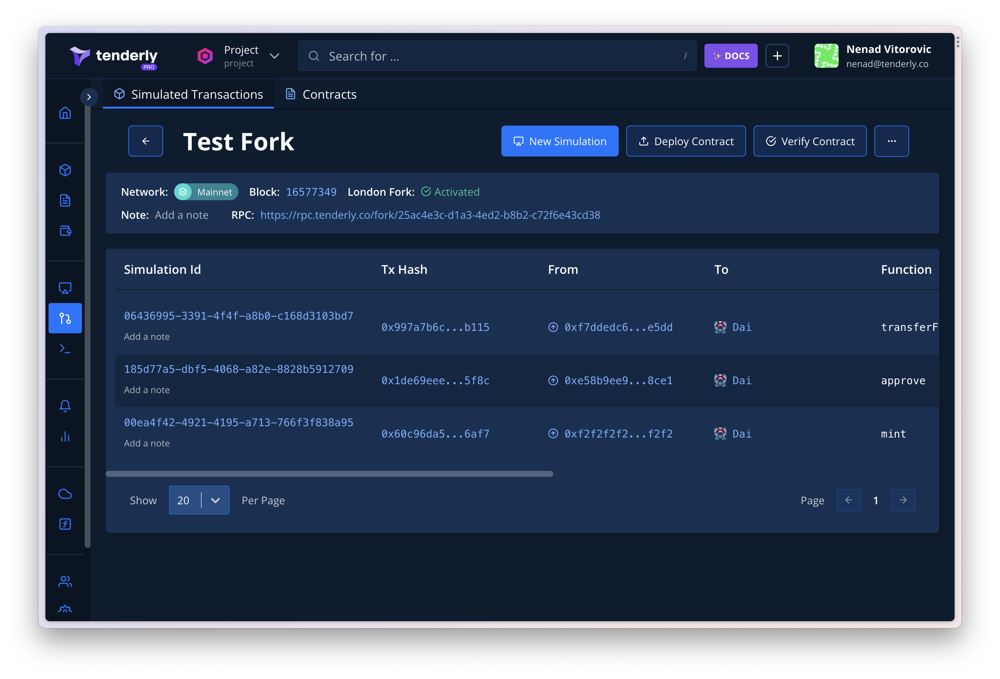

# Forks

Tenderly Forks are a lightweight blockchain replica where you can run transaction simulations. You can base your Fork on one of [Tenderly's supported networks](../../supported-networks-and-languages.md) and any of the blocks in a specific network's history. All transactions you simulate through Forks are recorded in an isolated timeline.&#x20;

You can use Forks through:

* The **Fork UI** for an IDE-like experience. Follow the [Using Forks UI guide](using-forks-ui.md) to get started.
* The **Fork JSON RPC** that allows you to use Forks as a lightweight blockchain provider. This way, you can:
  * Interact with Forks via Ethers.js. Follow the [Using Forks with Ethers.js](using-forks-with-ethers.js.md) guide to learn more.
  * Integrate the RPC into a Hardhat project, by using it as a network URL in hardhat.config. You can use that network to test your deployment scripts and/or run smart contract tests. Explore this [example hardhat project](https://github.com/Tenderly/tenderly-examples/tree/master/multisig-wallet) for details.
  * Integrate the RPC in a dapp UI, by using the Fork URL as a provider. See this [example project](https://github.com/Tenderly/tenderly-examples/tree/master/multisig-ui-simulations).

Additionally, you can do various custom actions on a Fork:

* [Advance/mine a block](../reference/tenderly-fork-customization-via-api/how-to-advance-mine-the-block.md)  (`evm_increaseBlocks`)
* [Advance time](../reference/tenderly-fork-customization-via-api/how-to-advance-time-on-fork.md) on the Fork (setting the `timestamp`)
* [Move the head](../reference/tenderly-fork-customization-via-api/how-to-point-the-fork-to-a-specific-simulation.md) of the Fork (`evm_snapshot` and `evm_revert`)
* [Manage account balances](../reference/tenderly-fork-customization-via-api/how-to-manage-account-balances-in-tenderly-forks.md) (`tenderly_setBalance` and `tenderly_addBalance`)
* [Override smart contract storage ](../reference/tenderly-fork-customization-via-api/how-to-change-storage-values-on-a-fork.md)(`tenderly_setStorageAt`)&#x20;


Each time you create a Tenderly Fork, you get 10 accounts, each with a balance of 100 test tokens.


<figure><figcaption></figcaption></figure>

###
