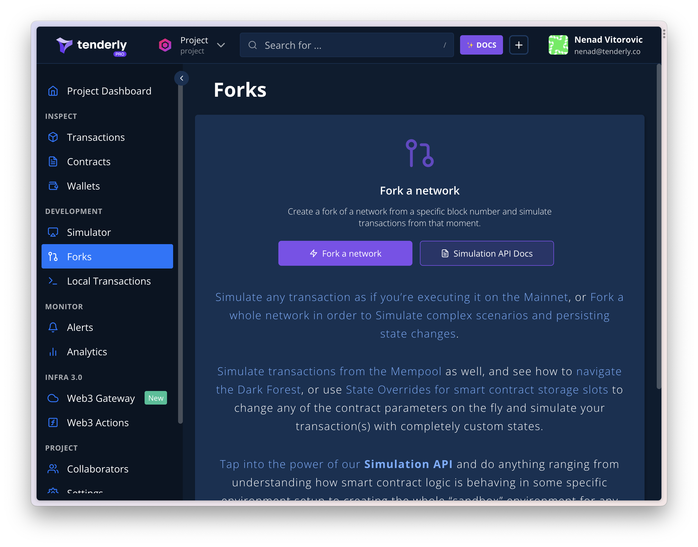
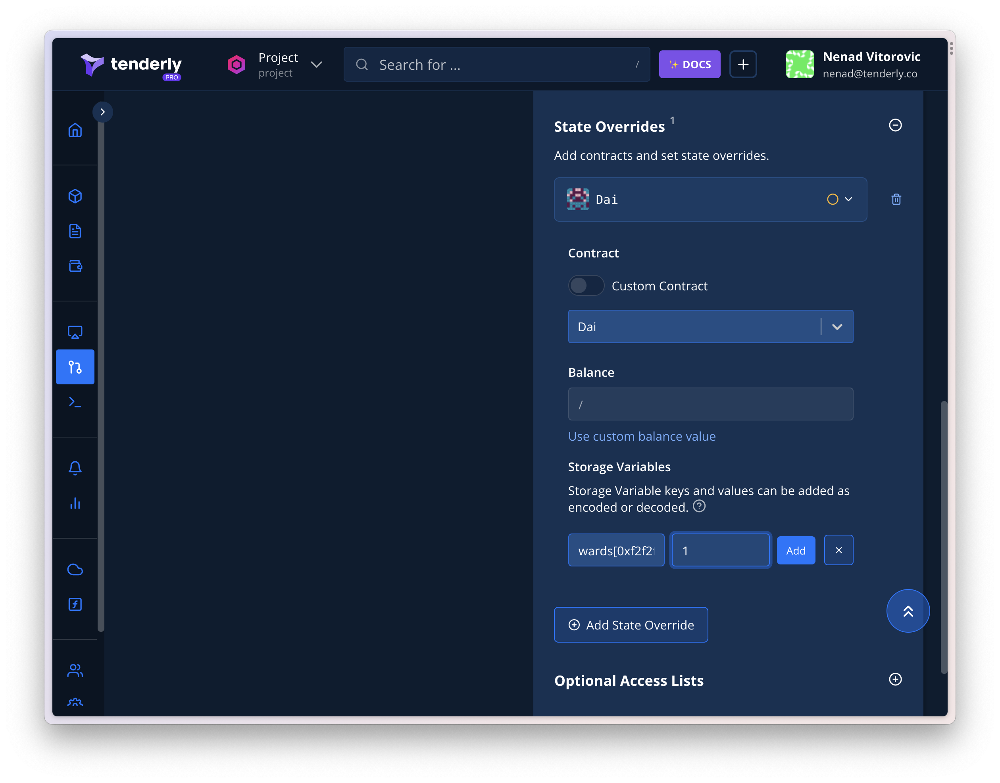
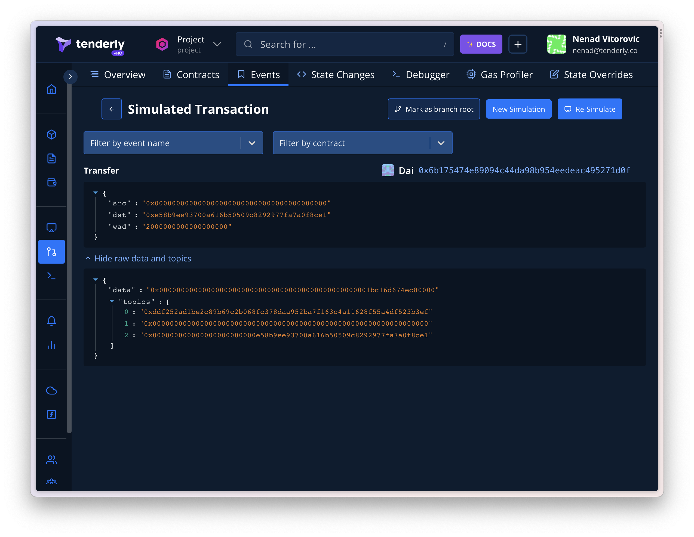
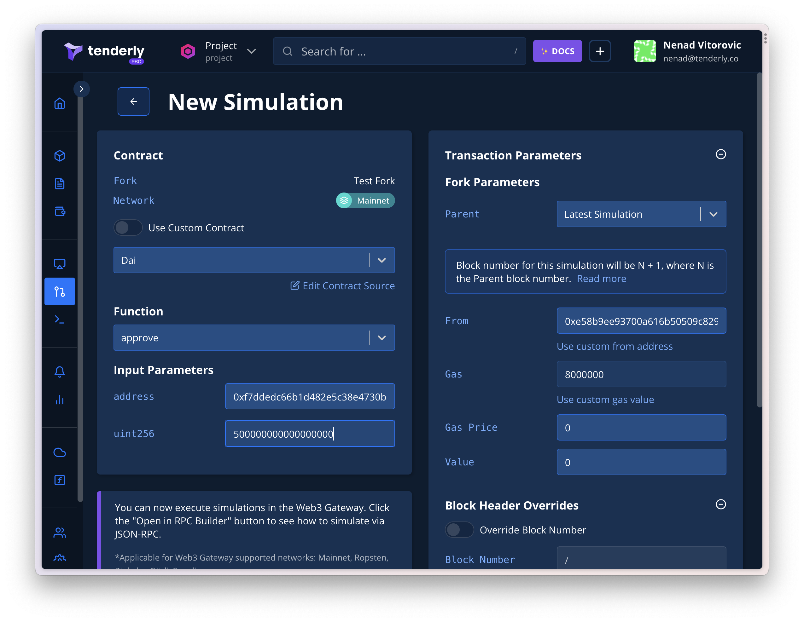
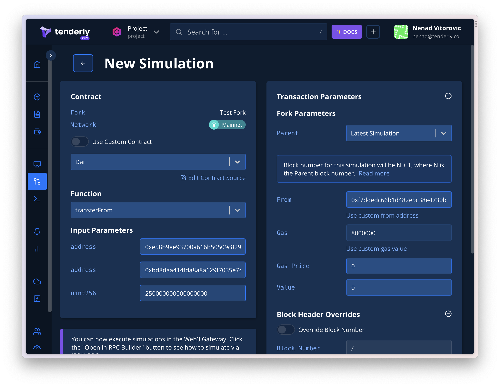

# Using Forks UI

The following guide shows you how to create a Fork using the Tenderly Dashboard. Once you create the Fork, you can simulate transactions.

In this example, we'll simulate:

1. **TX1 – mint**: We'll use an arbitrary address to mint 2 DAI for `0xe58b9ee93700a616b50509c8292977fa7a0f8ce1` .
2. **TX2 – approve**: The address `0xe58b9ee93700a616b50509c8292977fa7a0f8ce1` will approve `0xf7ddedc66b1d482e5c38e4730b3357d32411e5dd` to spend 0.5 DAI.
3. **TX3 – transferFrom:** Тhe address we just approved (`0xf7ddedc66b1d482e5c38e4730b3357d32411e5dd`) will transfer 0.25 DAI to `0xbd8daa414fda8a8a129f7035e7496759c5af8570`.

## Create a Fork

First, from the navigation menu on your left, select **Forks** and then:&#x20;

* Click the **Create Fork** button.&#x20;
* Select the network you'd like to fork.&#x20;
* Name your Fork as you like.&#x20;
* Choose a specific block number if needed.&#x20;

Alternatively, you can use the Fork API to create a Fork programmatically.

After creating a Fork, you can use:

* The Fork UI to send transactions in an IDE-like environment.
* The Fork RPC to send transactions via Ethers.js.

The Fork exposes JSON RPC access. The RPC link is located in the Fork header.

<figure><figcaption></figcaption></figure>

## TX1: Simulate DAI minting with state overrides

First, we need to mint 2 DAI (`2000000000000000000` wei) for `0xe58b9ee93700a616b50509c8292977fa7a0f8ce1`. We'll use the address `0xf2f2f2f2f2f2f2f2f2f2f2f2f2f2f2f2f2f2f2f2` as the minter.&#x20;

Since this isn't an actual ward on Mainnet DAI, we'll have to use state overrides to make it a ward during the simulation.

<figure><figcaption></figcaption></figure>

To complete this, follow these steps:

**Step 1:** Click the **New Simulation** button.

**Step 2:** Select the Dai contract from the dropdown.

**Step 3:** Select the **mint** function from the Function dropdown.

**Step 4:** Paste into the `usr` field `0xe58b9ee93700a616b50509c8292977fa7a0f8ce1` as the address of the receiver of the minted DAI.

**Step 5:** Paste `2000000000000000000`into the`wad`field, as the amount.

**Step 6:** Paste `0xf2f2f2f2f2f2f2f2f2f2f2f2f2f2f2f2f2f2f2f2` into the **from** field on the right. This is the address that will pretend to be able to mint.

Next, you need to complete the state override.&#x20;

If you check the source of the DAI contract, you'll see the `wards` mapping from an address to a number. Essentially, for minting to work, we have to plant `0xf2...f2` as a ward. This is the exact state override we must complete.

```
wards[0xf2f2f2f2f2f2f2f2f2f2f2f2f2f2f2f2f2f2f2f2] = 1
```

**Step 7:** Scroll down and click **State Overrides** and then **Add State Override**.

<figure><figcaption></figcaption></figure>

**Step 8:** Select the Dai contract from the dropdown.

**Step 9:** Scroll to **Storage variables** and click the **Add more** button.

**Step 10:** In the **key** field, paste the left-hand side of the ward assignment (`wards[0xf2f2f2f2f2f2f2f2f2f2f2f2f2f2f2f2f2f2f2f2]`).

**Step 11:** In the **value** field, paste the right-hand side of the ward assignment (1).

**Step 12:** Click Simulate.

Now, the account `0xe58b9ee93700a616b50509c8292977fa7a0f8ce1` has 2 DAI at their disposal.

**Step 13:** Verify this by checking the Events tab. 🎉

<figure><figcaption></figcaption></figure>

## TX2: Simulate the call to approve

The second transaction entails the address `0xe58b9ee93700a616b50509c8292977fa7a0f8ce1` approving  `0xf7ddedc66b1d482e5c38e4730b3357d32411e5dd` to spend 0.5 DAI.

<figure><figcaption></figcaption></figure>

To run this simulation, follow these steps:

**Step 1:** Click the **New Simulation** button.

**Step 2:** Select the Dai contract from the dropdown.

**Step 3:** Select the **approve** function from the function dropdown.

**Step 4:** Paste the address `0xf7ddedc66b1d482e5c38e4730b3357d32411e5dd` to the **usr** input.

**Step 5:** Paste the value `500000000000000000` to the `wad` field.

**Step 6:** Paste the address `0xe58b9ee93700a616b50509c8292977fa7a0f8ce1` to the **from** field.

**Step 7:** Click Simulate.

**Step 8.** Check the Events tab to verify the **Approval** event is there. 🎉

## TX3: Simulate the call to transferFrom

The last transaction approves the spender (`0xf7ddedc66b1d482e5c38e4730b3357d32411e5dd`) to transfer 0.25 DAI to `0xbd8daa414fda8a8a129f7035e7496759c5af8570`.

<figure><figcaption></figcaption></figure>

Here are the needed steps:

**Step 1:** Click the **New Simulation** button.

**Step 2:** Select the Dai contract from the dropdown.

**Step 3:** Select the **transferFrom** function from the function dropdown.

**Step 4:** Paste the address `0xbd8daa414fda8a8a129f7035e7496759c5af8570` to the **usr** input.

**Step 5:** Paste the value `250000000000000000` to the `wad` field.

**Step 6:** Paste the spender address (`0xf7ddedc66b1d482e5c38e4730b3357d32411e5dd`) to the **from** field.

**Step 7:** Click Simulate.

**Step 8:** Check the Events tab to verify that the **Approval** event is there. 🎉
