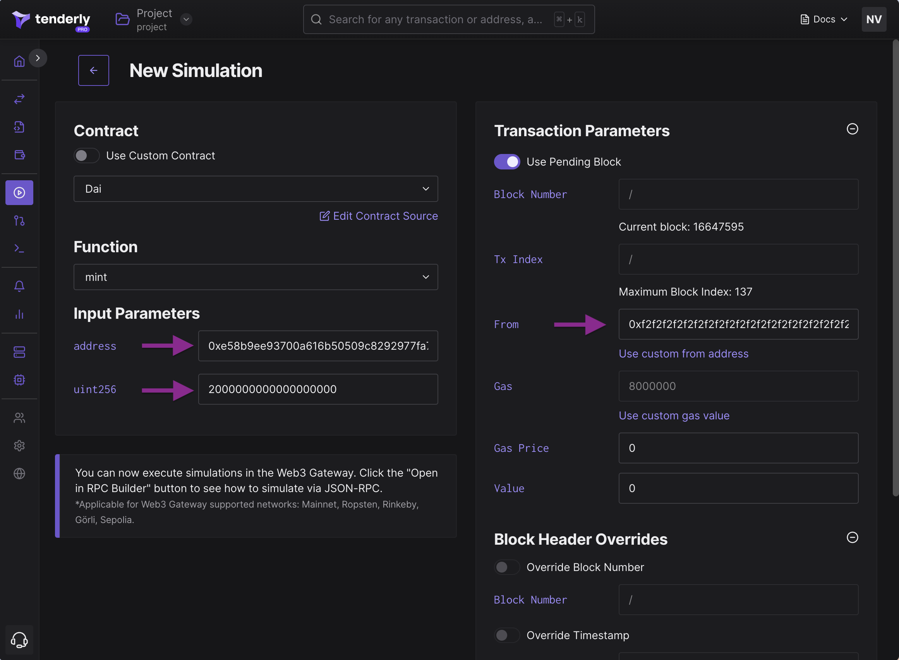
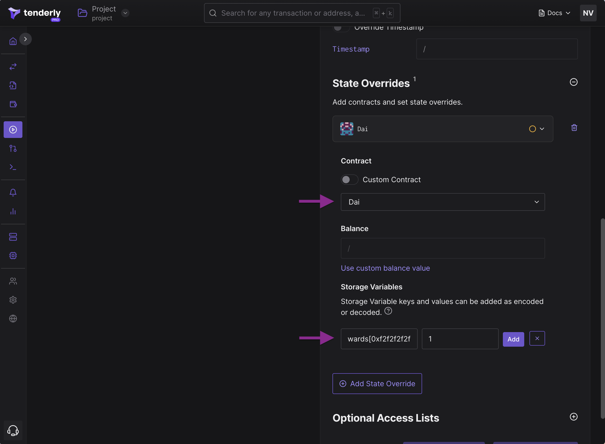
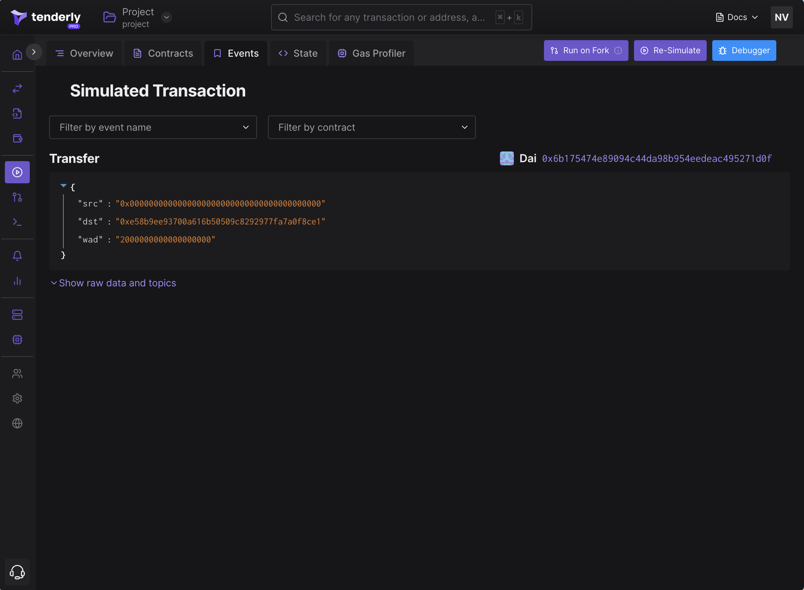
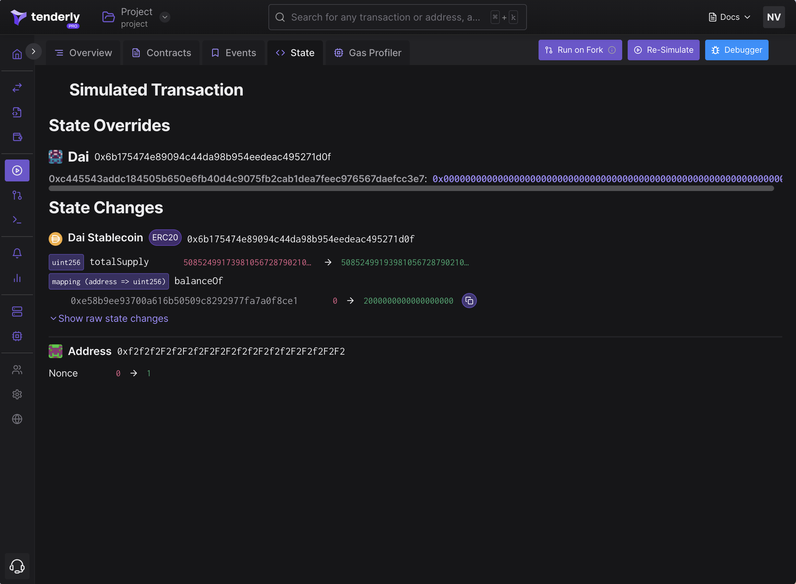

# Simulation UI With State Overrides

State overrides allow you to specify custom values for smart contract state variables and impose custom conditions before running a simulation. This allows for experimentation and understanding of smart contract behavior and usage.

### Example: minting 2 DAI

We'll simulate minting 2 DAI (`2000000000000000000` wei) for the owner `0xe58b9ee93700a616b50509c8292977fa7a0f8ce1`. We'll use the address `0xf2f2f2f2f2f2f2f2f2f2f2f2f2f2f2f2f2f2f2f2` as the minter. Since this isn't an actual ward on Mainnet DAI, we have to use state overrides to make it a ward during this simulation.

If you check the source of the Dai contract, you'll see the `wards` mapping from an address to a number. Essentially, for minting to work, we have to plant `0xf2...f2` as a ward, which is the state override we must do.

```
wards[0xf2f2f2f2f2f2f2f2f2f2f2f2f2f2f2f2f2f2f2f2] = 1
```

The example covers the following steps:&#x20;

**Step 0:** Go to **Contracts** on your left and click **Add Contracts** to add the Dai contract to your project. Then, paste `0x6b175474e89094c44da98b954eedeac495271d0f` to the **contract address** field and select the **Mainnet** as the network from the dropdown.&#x20;

<figure><figcaption><p>Filling in simulation parameters</p></figcaption></figure>

**Step 1:** Go to **Simulations** in the navigation menu on your left.&#x20;

**Step 2:** Choose Dai from the contract dropdown menu.

**Step 3:** Select **mint** as the function from the corresponding dropdown menu. &#x20;

**Step 4:** Paste `0xe58b9ee93700a616b50509c8292977fa7a0f8ce1` to the **usr** field and `2000000000000000000` to the **ward** field.&#x20;

**Step 5:** Paste `0xf2f2f2f2f2f2f2f2f2f2f2f2f2f2f2f2f2f2f2f2` to the **from** field.&#x20;

**Step 6:** Scroll down to **State Overrides**, click **Add State Override,** and pick **Dai** from the dropdown.&#x20;

<figure><figcaption><p>Specifying <code>wards[0xf2...f2]=1</code> state override</p></figcaption></figure>

**Step 7:** In the **Storage Variables** section, click **Add More**, pick `wards[]`, and replace it with `wards[0xf2f2f2f2f2f2f2f2f2f2f2f2f2f2f2f2f2f2f2f2]`.&#x20;

**Step 8:** Set the **value** field to `1` and click **Add**.

**Step 9:** Scroll down and click **Simulate**.&#x20;

**Step 10.** Navigate to the **Events** tab to see the **Transfer** event.&#x20;

**Step 11:** Go to the State Changes tab to verify that the **balanceOf** mapping has changed for the owner `0xe5..e1`.

<div>

<figure><figcaption><p>The transfer event during minting</p></figcaption></figure>

 

<figure><figcaption><p>State Changes: the <code>balanceOf</code> change for the owner</p></figcaption></figure>

</div>
