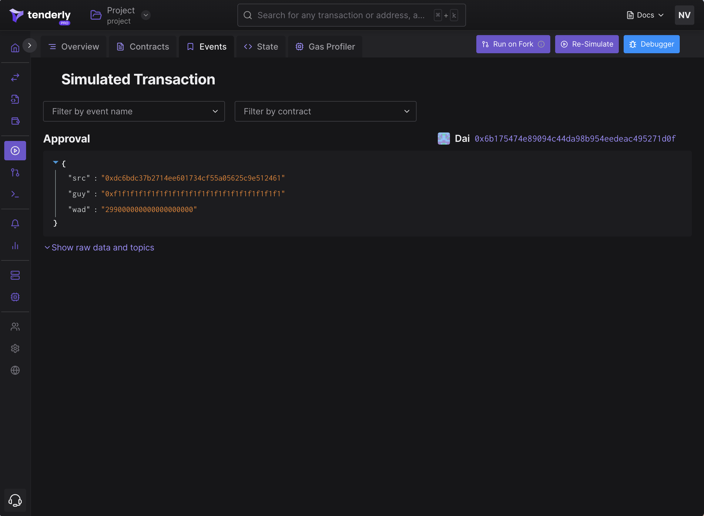
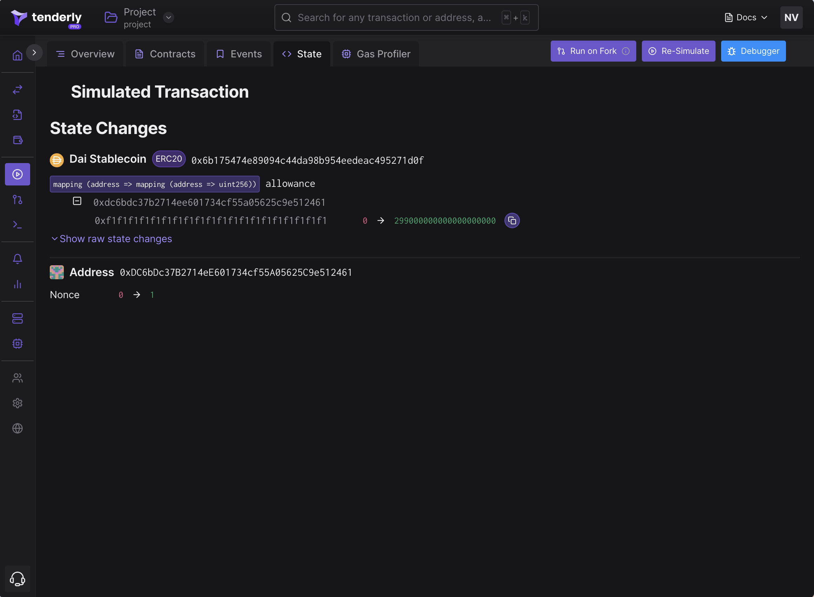

# Using Simulation UI

The following example guides you through running simulations using the Simulation UI.&#x20;

### Example: simulating DAI approval

We'll use the Simulation UI to simulate DAI approval. The ERC-20 token owner `0xdc6bdc37b2714ee601734cf55a05625c9e512461` will approve 299 DAI to the spender `0xf1f1f1f1f1f1f1f1f1f1f1f1f1f1f1f1f1f1f1f1`.

This example shows:

* The approval will succeed even though the account `0xdc6bdc37b2714ee601734cf55a05625c9e512461` doesn't have any DAI balance.
* You can simulate a transaction as any sender, even if you don't have access to the private keys of that account. This is possible since Tenderly simulates the **execution of unsigned transactions**.

<figure><figcaption>
Setting the simulated transaction's parameters
</figcaption></figure>

Here are the needed steps:

**Step 0:** Add the Dai contract to your project. Click **Contracts** in the left-hand side menu and then **Add Contract.** Paste `0x6b175474e89094c44da98b954eedeac495271d0f` to **contract address** and select **Mainnet** from the network dropdown.&#x20;

**Step 1:** From the left-hand side menu, pick **Simulations**.&#x20;

**Step 2:** From the contract dropdown, pick **Dai**.&#x20;

**Step 3:** From the **Function** dropdown, select **approve**.&#x20;

**Step 4:** Paste `0xf1f1f1f1f1f1f1f1f1f1f1f1f1f1f1f1f1f1f1f1` to the **usr** field and `299000000000000000000` to the **ward** field.&#x20;

**Step 5:** Paste `0xdc6bdc37b2714ee601734cf55a05625c9e512461` to the **from** field.&#x20;

**Step 6:** Scroll down and click **Simulate**.

**Step 7:** Go to the **Events** tab to see the **Approval** event. Go to the **State Changes** tab to verify that the **allowance** for  `0xf1...f1` increased.

<figure><figcaption>
Approval event
</figcaption></figure>

 

<figure><figcaption>
State Changes: the <code>allowance</code> change for the owner
</figcaption></figure>

