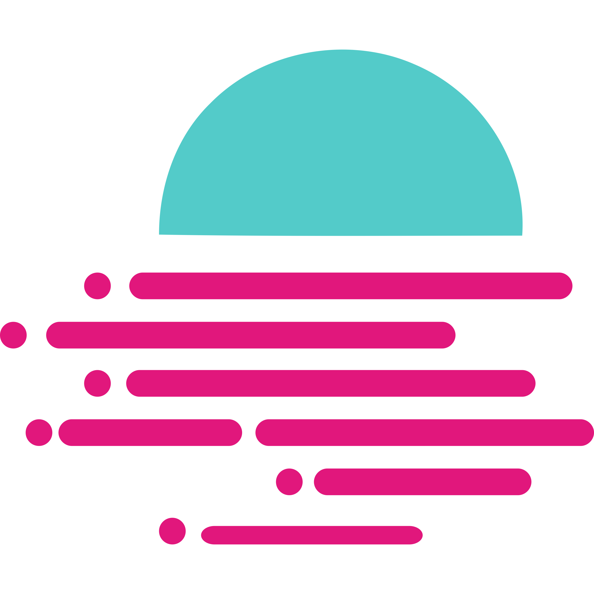

# 🗺 Supported Networks & Languages



**Networks supported in Tenderly and** [**accessible through Web3 Gateway**](http://blog.tenderly.co/how-to-deploy-smart-contracts-with-hardhat-and-tenderly/)

All Tenderly features are enabled including Web3 Gateway integration.

 Mainnet

 Goerli

 Sepolia

 Boba Ethereum

**Networks supported in Tenderly, without Web3 Gateway access**

All Tenderly features are enabled, with few [exceptions](supported-networks-and-languages.md#footnotes) due to the integration process.

Web3 Gateway integration is not present. We're working on incremental integration.

 RSK

 RSK Testnet

 BSC

 BSC Testnet

 Gnosis Chain

 POA

 Polygon

 Polygon Mumbai

 Optimistic Ethereum

 Optimistic Goerli Testnet

 Avalanche C-Chain

 Avalanche C-Chain Fuji

 Fantom

 Fantom Testnet

 Arbitrum One

 Arbitrum Goerli Testnet

 Moonbeam[\*](supported-networks-and-languages.md#footnotes)

Moonriver[\*](supported-networks-and-languages.md#footnotes)

 Cronos

Boba Network



 Solidity

 Vyper



### Footnotes&#x20;


\***Moonbeam** and **Moonriver** network integration is currently in **Phase 1**, with limited Tenderly tooling support.

**Phase 1:** partial integration. These are disabled or partially supported tools and services:

* Tenderly skips transactions with (a) differences in the execution path, (b) and transactions with precompiled contracts. \
  _Skipped transactions will not be accessible through the Tenderly platform._
* Gas Profiler is disabled due to slight imprecisions in gas calculations.
* Web3 Actions and Alerts are completely disabled due to skipping transactions.
* The remaining Tenderly features will operate as expected.

**Phase 2**: complete integration with all Tenderly tools supported

* Supporting transactions involving precompiled contracts.
* Enabling Gas Profiler with full accuracy
* Enabling Alerts and Web3 Actions.

