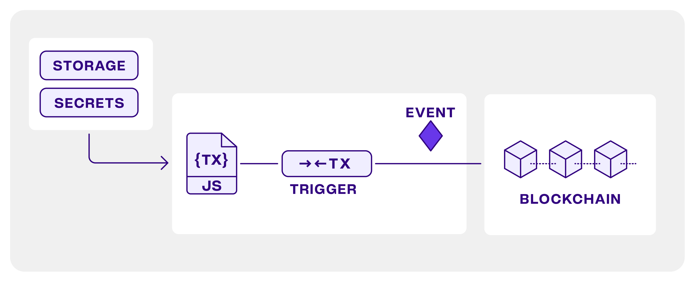
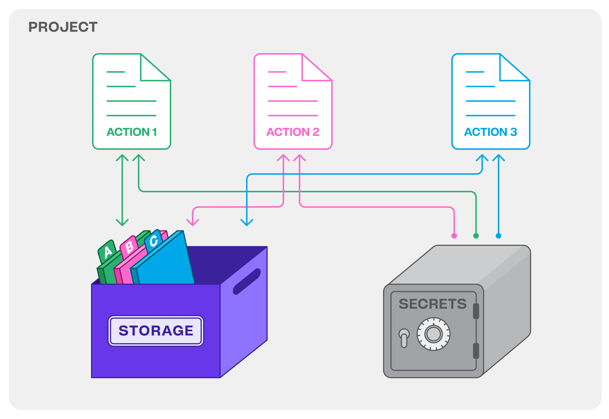

# Intro to Web3 Actions

### What are Web3 Actions?

Web3 Actions are programmable hooks for smart contract and chain events. They can also be serverless backends for your dapps. A Web3 Action is a regular TypeScript/JavaScript function that runs on Tenderly infrastructure.&#x20;

A Web3 Action comes with key-value storage for data you need to persist and secrets management for sensitive information such as API keys. You can think of Web3 Actions as infrastructure building a Web3 version of IFTTT/Zapier automation, allowing you to glue together your smart contracts, on-chain events, dapp frontends, APIs, and other services.&#x20;

Based on the trigger rules you define, external on-chain or off-chain events will trigger your Web3 Action and your JavaScript/TypeScript code will handle the event instantly. This is where you activate monitoring, through building automation that addresses the needs of your users and your project.

With Web3 Actions, you can build systems that let you be timely informed about non-trivial events. This way, you can improve your dapp in terms of UX and interactivity and enhance your project through the depth of information you can collect or share through notifications.&#x20;

To get an idea of what’s possible with Web3 Actions, here are some use cases:

* **Watch out for important transactions**: Build a real-time(ish) data-rich notification system for events emitted from a contract by sending messages to Discord, Slack, or Telegram or posting it to a database.
* **When a block is mined**: Monitor changes in on-chain assets or gas prices to build customized analytics and automation. Then, post the data to an external API.
* **Expose a webhook**: Enhance your dapp by exposing a webhook that handles users' inputs.
* **Periodic automation**: Periodically simulate a transaction execution using [Tenderly simulations](../simulations-and-forks/how-to-simulate-a-transaction/#simulating-a-transaction) and send the results to Slack and/or even send the transaction to the chain to achieve automation.

For more ideas, check out the [Use cases for Web3 Actions and different events](intro-to-web3-actions.md#use-cases-for-web3-actions-and-different-events) section.


Web3 Actions are rate-limited. The current usage rate limit for the execution of Web3 Actions is 100 executions/5 minutes, per user. Any extra executions will be skipped.


### Quickstart guides

Follow these guides to quickly get started with building Web3 Actions via the browser or command line tools.

Setting up Web3 Actions requires you to write JavaScript code for your functions. Building your Web3 Actions using Tenderly CLI includes defining triggers in a [yaml configuration file](references/project-structure.md#the-tenderly.yaml-file-structure). The defined trigger and yaml configuration become an integral part of your project’s codebase.

* [Deploy Web3 Actions via Tenderly Dashboard](broken-reference): Learn how to set up and deploy Web3 Actions directly in your browser.
* [Deploy Web3 Actions via Tenderly CLI:](tutorials-and-quickstarts/deploy-web3-actions-via-dashboard.md) Learn how to install the Tenderly CLI, define triggers using the YAML configuration, and set up and deploy Web3 Actions through the command line.


To set up Web3 Actions triggered by transaction-related events, you must use the CLI-based approach.



[cli-cheatsheet.md](references/cli-cheatsheet.md)


### Understanding Web3 Actions

In a nutshell, Web3 Actions instruct Tenderly to listen for a specific external event to occur and run your code as events happen.

You need to provide a **trigger specification** that is related to a pre-defined external event. A Web3 Action can be triggered every few blocks as they’re mined (block trigger), when a relevant transaction is executed (transaction trigger), via a webhook it exposes (webhook trigger), or at specific time intervals (periodic trigger).

When the event occurs, Tenderly executes your custom code (function). Here, monitoring becomes active. You can send data to an external API, write to a database, deliver a push notification or a data-rich message through messaging services, or even send a new transaction to the blockchain, to name a few examples.

Let’s get familiar with the three core elements of Web3 Actions: **functions**, **events**, and **trigger specification**.

<figure><figcaption>
The elements of Web3 Actions
</figcaption></figure>

**Functions:** The custom JavaScript or TypeScript code you want to execute when an external event you specified occurs. Functions can be written directly in the browser through the Tenderly Dashboard or using the CLI (within an npm project). In both cases, the function must be a named export from the defining file.

**Events:** Instances of pre-defined external events that you can listen for by configuring a trigger. The function receives the event object as an argument, making the data about the event available to your function code. These are supported events:

* **Block:** Run a function each time a block is mined.
* **Periodic:** Run a function at specific intervals.
* **Webhook:** Call the Web3 Action via HTTP.
* **Transaction:** React to contract transactions that match a specific filter.

**Trigger specification:** A schema or a pattern describing external events your Web3 Action should listen for.&#x20;

When building a Web3 Action, you have to link the trigger specification to the function you wish to run. Tenderly executes your custom code (function) when it detects the event specified in the trigger.&#x20;

Learn how to configure [Web3 Action Functions, Events, and Triggers](references/action-functions-events-and-triggers.md).

#### Web3 Actions Utilities

**Error reporting:** An overview in the Tenderly Dashboard where you can find errors and incidents that have occurred during the execution of your Web3 Action and re-execute failed ones. Learn more about [Error Handling in Web3 Actions](broken-reference).

**Secrets:** A place to store sensitive data such as API keys that are called from inside your code. This information is stored in the Tenderly Dashboard and can only be read from your code.

**Storage:** Project-wide key-value storage you can use to persist data between consecutive runs. You can read and write to Storage through the Tenderly Dashboard. Learn how to [manage Secrets and use Web3 Actions Storage](references/context-storage-and-secrets.md).

<figure><figcaption>
Web3 Action Storage and Secrets
</figcaption></figure>

#### Local development and testing support

To quickly iterate when writing your Web3 Action functions, explore how the `@tenderly/actions-test` npm package provides [support for testing and local development of action function code](references/local-development-and-testing.md).

### Use cases for Web3 Actions and different events

Below is a brief overview of each event type and example use cases.

🧾 **Transaction event:** Listens for a transaction event that matches a given set of criteria — successful or failed transaction, value transfers, a particular amount of gas a transaction used, event emitted, and much more. Learn about [Transaction events](references/action-functions-events-and-triggers.md#transaction-event).

Example use cases:

* Collect specific data about transactions as they happen and store them in Tenderly Storage.
* Send the data about a transaction to other (Web2 or Web3) services via HTTP.
* Send data-rich notifications about wanted or unwanted transactions through your communication channels, such as Discord.
* Send a transaction to the chain from a Web3 Action itself.

🔢 **Block event:** Listens for an event when a block is mined on a selected network. Learn about [Block events](references/action-functions-events-and-triggers.md#block-event).

Example use cases:

* Monitor changes in on-chain assets to build customized analytics and automation.
* Monitor smart contract changes once every few blocks get mined and run automation when a condition is met.
* Monitor gas prices and automate your operations.

🪝 **Webhook event:** Listens for an event **when** an HTTP request is posted to the Webhook URL (the action exposes a WebHook). Learn about [Webhook events](references/action-functions-events-and-triggers.md#webhook-event).

Example use cases:

* Build a serverless backend that handles your dapp users' input.
* Retrieve the data your other Web3 Actions collected about transactions or specific smart contract changes.
* Your CI can call the webhook to clean up or prepare other Tenderly resources such as the [Forks you use for testing](https://docs.tenderly.co/simulations-and-forks/simulation-api/testing).

🕖 **Periodic event:** Listens for an event representing a passage of a time interval or CRON expression you specify. Learn about [Periodic events](references/action-functions-events-and-triggers.md#periodic-event).

Example use cases:

* Periodically send notifications with custom data collected from the network and/or aggregated in Web3 Action Storage.
* Simulate a DAO proposal and send a voting reminder to Discord.
* Simulate a transaction execution using Tenderly simulations and send the outcome to Slack and/or send the transaction on-chain to achieve automation.
* Periodic cleanup of Tenderly infrastructure (e.g., point a Fork to the latest block on the Mainnet before continuing simulations).

### Web3 Actions tutorials

If you want a full tutorial, here’s a step-by-step guide for monitoring an on-chain Tic-Tac-Toe game, with all relevant explanations, from deploying the game contract to displaying the board after a move.


[how-to-handle-on-chain-events.md](tutorials-and-quickstarts/how-to-handle-on-chain-events.md)


To see how to build a Web3 Action to send a message to Discord when a Uniswap pair is created and fetch some data using Axios, this is the place:


[how-to-send-a-discord-message-about-a-new-uniswap-pool.md](tutorials-and-quickstarts/how-to-send-a-discord-message-about-a-new-uniswap-pool.md)


To deploy your own simple Oracle in a Tenderly Web3 Action, explore this tutorial:


[how-to-build-a-custom-oracle.md](tutorials-and-quickstarts/how-to-build-a-custom-oracle.md)


To see how a Web3 Action can use Forks to simulate a transaction submitted to a multisig wallet and send Discord messages with simulation outcomes, try this one:



### Resources

Here you can find all the relevant information about the main building blocks and accompanying tools:

Find details about the Web3 Actions project structure and general layout of the **tenderly.yaml** configuration file:


[project-structure.md](references/project-structure.md)


Find detailed information about the core components of Web3 Actions and writing trigger configuration in **tenderly.yaml**:


[action-functions-events-and-triggers.md](references/action-functions-events-and-triggers.md)


Learn about using Storage and Secrets:


[context-storage-and-secrets.md](references/context-storage-and-secrets.md)


Learn about tools for local development and testing of Web3 Actions:


[local-development-and-testing.md](references/local-development-and-testing.md)


Learn about utilities for inspecting and handling failed executions of Web3 Actions in the Tenderly Dashboard:


[error-reporting.md](references/error-reporting.md)


Learn how to operate Web3 Actions: stopping, upgrading, and running Web3 Actions manually:


[stopping-upgrading-and-manually-running-web3-actions.md](references/stopping-upgrading-and-manually-running-web3-actions.md)

