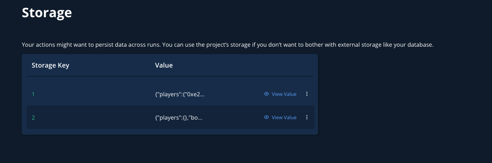
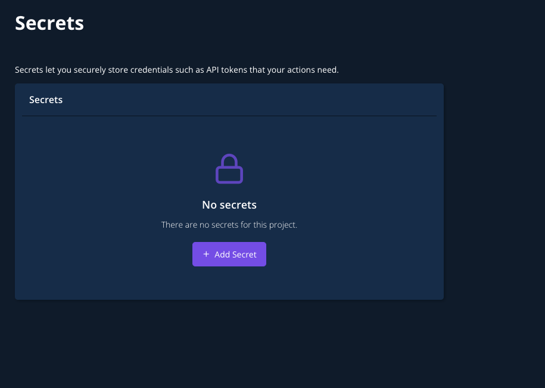

# Context, Storage, and Secrets

In this guide, you’ll learn how to create, manage, and access private data such as API keys when creating Web3 Actions, how to persist data to Storage, and how to access that data from your application.

### Context

`context` is an object that gives you access to Storage and Secrets from within your code. Context is the first parameter that needs to be specified in your functions, enabling access to the execution context when Tenderly runs your code.

```typescript
export const actionFun: ActionFn = async (context: Context, event: Event) => {
  // ...
  await context.storage.putJson(key, storedValue);
};
```


Storage and Secrets are shared between all Actions within a project in Tenderly.


### Storage

You can use the Storage utility to make your Web3 Actions stateful. Web3 Actions Storage is a key-value-based store. You can save data to Storage both from your custom code (functions) and the Tenderly Dashboard.

Below is a code snippet that shows you how to store JSON objects to Storage.

```javascript
await context.storage.putJson(key, valueStored);
```


All functions that interact with Storage are asynchronous, so you need to use the `await` operator to avoid undesired behavior.


#### Saving and retrieving data from Storage

To save data to Storage, use the following functions, which store values of their respective type:

* `putBigInt`
* `putStr`
* `putNumber`
* `putJson`

To retrieve data from Storage, use the following functions to fetch a specific data type:

* `getBigInt`
* `getStr`
* `getNumber`
* `getJson`

Below is an example of how to save and fetch a JSON object from Storage.

```javascript
await context.storage.putJson("BAR_BAZ", { bar: "baz" });
//....
const barBaz = await context.storage.getJson("BAR_BAZ");
```

#### Accessing Storage via the Tenderly Dashboard

To view data saved to Storage via the **Tenderly Dashboard**, go to **Actions** from the left-hand menu and click **Storage** from the page menu.

<figure><figcaption><p>Accessing Web3 Action data saved to Storage</p></figcaption></figure>

### Secrets

Secrets are used to store sensitive information such as private API keys for services that your Web3 Action might call during the execution. Secrets are stored as key-value pairs and are comprised of the name and secret value.

#### Creating and storing Secrets

The only way to create secrets is via the **Tenderly Dashboard**. Go to **Actions** from the left-hand menu and click **Secrets** from the page menu.

Add Secrets by clicking the **Add Secret** button and provide the key name and value.

<figure><figcaption><p>Creating Secrets for Web3 Actions</p></figcaption></figure>

#### Fetching Secrets data from inside your code

You can fetch Secrets data from within your code using the `context`object with the `get()` method. As the argument, use the exact key name you specified via the Tenderly Dashboard.

```javascript
const fooApiKey = await context.secrets.get("FOO_API_KEY");
```
