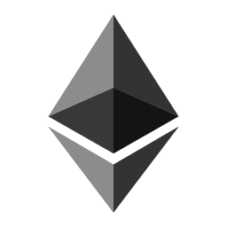

# Networks

You can reference the supported network in your trigger configuration with the following network IDs:

 Mainnet `=> 1`

 Kovan `=> 42`

 Ropsten (deprecated) `=> 3`

 Rinkeby (deprecated) `=> 4`

 Gorli`=> 5`

 RSK `=> 30`

 RSK Testnet `=> 31`

 BSC `=> 56`

 BSC Testnet `=> 97`

 POA `=> 99`

 xDai `=> 100`

 Polygon `=> 137`

 Polygon Mumbai `=> 80001`

 Optimistic Ethereum `=> 10`

 Optimistic Goerli Testnet `=> 420`

 Avalanche C-Chain `=> 43114`

 Avalanche C-Chain Fuji `=> 43113`

 Fantom `=> 250`

 Fantom Testnet `=> 4002`

 Arbitrum `=> 42161`

 Arbitrum Goerli Testnet `=> 421613`

 Cronos `=> 25`

 Cronos Testnet `=> 338`

 Boba Network `=> 288`

 Base Mainnet `=> 8453`

 Base Görli Testnet  `=> 84531`
