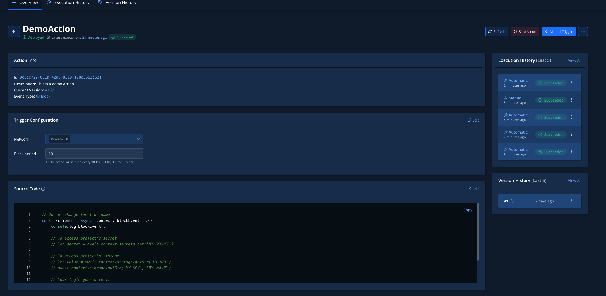
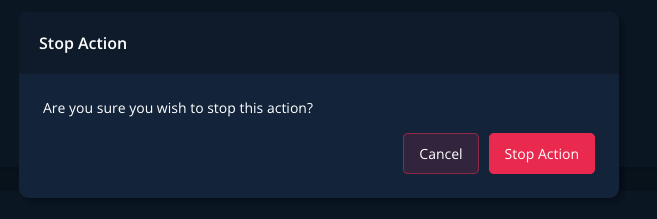
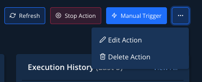
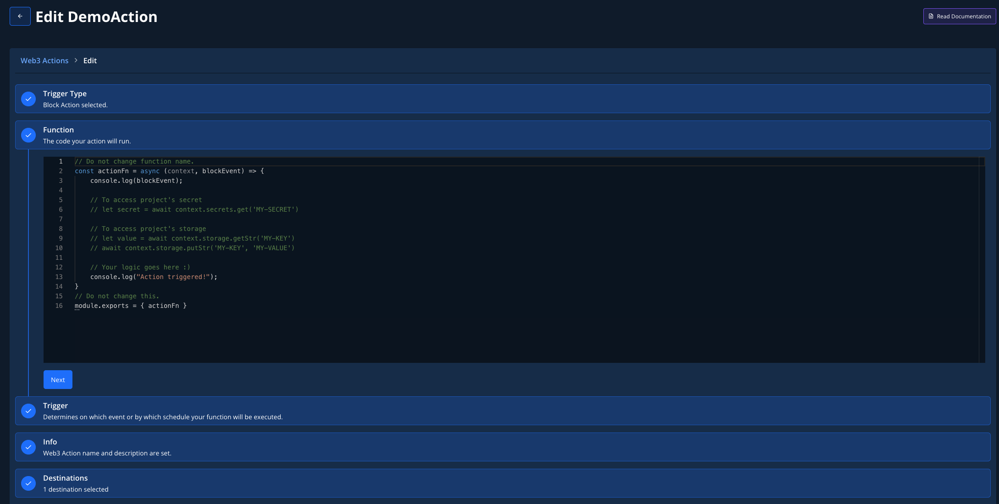

# Stopping, Upgrading, and Manually Running Web3 Actions

In this guide, you’ll learn how to:

* Manually stop the execution of Web3 Actions.
* Upgrade and edit deployed Web3 Actions without downtime.
* Manually execute Web3 Actions.

### Stop a Web3 Action

Web3 Actions run indefinitely until you stop their execution manually. To stop a Web3 Action, go to the Web3 Actions overview page where you'll see a list of all your Web3 Actions. Click the one you want to stop.

<figure><figcaption><p>Opening a Web3 Action you want to stop </p></figcaption></figure>

From the top right page menu, click on the **Stop Action** button.

<figure><figcaption><p>Clicking the Stop Action button</p></figcaption></figure>

You’ll be prompted to confirm your decision. Click the **Stop Action** button to confirm.

<figure><figcaption><p>Confirming that you want to stop a Web3 Action </p></figcaption></figure>

### Restart a stopped Web3 Action

While you’re still on the page of the stopped Web3 Action, click on the **Start Action** button from the top right page menu.

<figure><figcaption><p>Restarting a stopped Web3 Action</p></figcaption></figure>

You’ll be prompted to confirm your decision. Click the **Start Action** button to confirm.

### Upgrade and edit a Web3 Action

Deployed Web3 Actions are editable and upgradeable. You can safely make changes to any active and deployed Web3 Action without any downtime. The new version of your Web3 Action will be queued and deployed as soon as the previous version is done executing, ensuring zero downtime.

To edit a Web3 Action, go to the top right page menu and click on the **three dots icon**. From the dropdown, select **Edit Action**.

<figure><figcaption><p>Editing a Web3 Action</p></figcaption></figure>

You’ll be forwarded to the editing interface, where you can modify any of the parameters of your Web3 Action. Once you’re happy with the changes, click **Save** at the bottom of the page.

<figure><figcaption><p>Modifying Web3 Action parameters </p></figcaption></figure>

At any moment, you can revert to the previous version of your Web3 Action. Click on the **Version History** menu item to view all previous Web3 Action versions. Click the **Deploy** button next to the version of the Web3 Action you want to deploy.

### Trigger a Web3 Action manually

For your Web3 Action to work, the trigger type must be specified. You don’t need to configure the trigger setting. Web3 Actions without a specified trigger will never run automatically and you would need to run them manually.

To trigger a Web3 Action manually, click on the **Manual Trigger** button from the top right page menu. You can specify any payload you want as long as it matches the required schema.

If you specify block or transaction as the trigger type, you can fetch a transaction (by entering a transaction hash) or block (by entering the block number) from the actual network instead of manually creating a payload.

For example, if you deploy a Web3 Action that gets triggered once a block is mined on the Mainnet, this is the payload you can use to manually trigger that action.

```yaml
{
  "network": "1",
  "blockNumber": 1000,
  "blockHash": "0x5b4590a9905fa1c9cc273f32e6dc63b4c512f0ee14edc6fa41c26b416a7b5d58",
}
```
