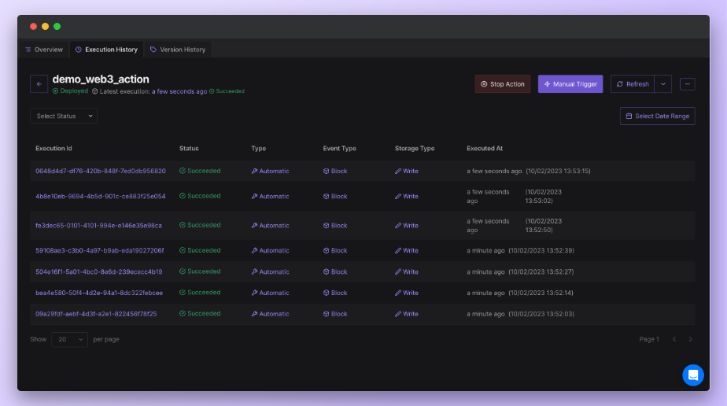

# Web3 Gateway Access

You can access [Tenderly’s production node Web3 Gateway](../../web3-gateway/) directly from your Web3 Action functions. This allows you to send transactions on the Mainnet or testnets and read on-chain data automatically through Web3 Actions.

Setting up Web3 Actions to access the blockchain requires minimal setup — a single Javascript variable. No need to worry about copying/pasting RPC URLs, managing secret keys, etc. Tenderly takes care of all this for you in the background.

In this guide, you’ll learn how to configure your Web3 Action function code to use Tendely’s production node to access the Mainnet.

## Web3 Gateway in Context

In Web3 Actions, access to Tenderly’s node is enabled through the `context` object. Learn more about [Web3 Actions Context](https://docs.tenderly.co/web3-actions/references/context-storage-and-secrets) here.

The `context` object contains a property called `gateways` which gives you access to the `getGateway()` method. This method requires one argument `Network`, which is used to specify the network you want to access.

The `Network` argument is also an object which gives you access to all the supported networks in Web3 Gateway:

* `Network.MAINNET`
* `Network.GOERLI`
* `Network.SEPOLIA`
* `Network.POLYGON`
* `Network.MUMBAI`
* `Network.BOBA_ETHEREUM`

To demonstrate how all of this comes together, here’s an example Javascript variable that is configured to access the Mainnet:

```jsx
const defaultGatewayURL = context.gateways.getGateway(Network.MAINNET);
```

## Example Web3 Action function to access the Mainnet

Let’s create a simple Web3 Action that will get triggered every time a new block is mined on the Mainnet. Each time a block gets mined, the Web3 Action will execute the custom code, also referred to as “function”. Read more about [Web3 Action functions](https://docs.tenderly.co/web3-actions/references/action-functions-events-and-triggers#action-functions) here.

For the sake of simplicity, the example function below will get the block number of the latest block mined and log it to the console.

You can read the comments to understand what each line of code does.

```jsx

// Required libraries that must be included for the code to work
const ethers = require("ethers")
const { Network } = require("@tenderly/actions")

// Do not change the default 'actionFn' name.
const actionFn = async (context, blockEvent) => {

	// Setting a variable that will store the Web3 Gateway RPC URL and secret key
	const defaultGatewayURL = context.gateways.getGateway(Network.MAINNET);

	// Using the Ethere.js provider class to call the RPC URL
	const provider = new ethers.providers.JsonRpcProvider(defaultGatewayURL);

	// Logging the block number of the latest mined block
	console.log(await provider.getBlockNumber())
    
}

// Exporting the default module. Do not change this.
module.exports = { actionFn }
```

Next, go to the **Dashboard** → **Web3 Actions** → **Add Action**.

<figure><figcaption><p>Web3 Action set up wizard</p></figcaption></figure>

* For the Trigger Type, select **Block.**
* In the **Function** textbox, paste the code from the example above and click **Next**.

<figure><figcaption><p>Custom code that is executed when the Web3 Action is triggered</p></figcaption></figure>

* Set the **Trigger** by selecting the network. In our case, that is **Mainnet**.
* Also, set the **Block Period** to tell Tenderly how often to execute the Web3 Action function. For example, if you put 1, the Web3 Action will be executed once every block is mined.
* In the **Info** fields, **add a name** for the Web3 Action and an optional description.
* You can also set a **Destination** where you’ll [receive notifications](https://docs.tenderly.co/web3-actions/references/notifications) about failed executions of the Web3 Action.
* Lastly, **click Create** to deploy the Web3 Action.

From the **Execution History** page, we can see that the Web3 Action is being executed successfully.

<figure><figcaption><p>Web3 Action execution history</p></figcaption></figure>

You can click on the **Execution Id** to see details about the executed Web3 Action and the payload in JSON.

### Helpful resources

For more information on how to manage your Web3 Actions and monitor execution errors, read the following guides:

* [Managing Web3 Actions](https://docs.tenderly.co/web3-actions/references/stopping-upgrading-and-manually-running-web3-actions)
* [Error Reporting for Web3 Actions](https://docs.tenderly.co/web3-actions/references/error-reporting)
