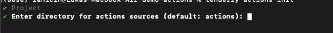

# Deploy Web3 Action via CLI

In this guide, you’ll learn how to deploy Web3 Actions via the Tenderly CLI that watches for blocks as they're mined and simply outputs the block number.&#x20;

### Prerequisites

You need to have npm and the Tenderly CLI installed and properly configured on your local machine. Check out the [Web3 Actions CLI Cheatsheet](../references/cli-cheatsheet.md) for installation instructions.

### Initializing a Web3 Actions Project

Navigate to the folder on your system where you want to place your Web3 Action code and the following command to initialize a new Web3 Actions project:

```bash
tenderly actions init
```

By default, the project will be configured to use TypeScript. If you prefer plain JavaScript, add the language flag and specify javascript:

```bash
tenderly actions init --language javascript
```

When prompted, select an existing Tenderly project from your account or create a new one.

<figure><figcaption><p>Creating a new Tenderly project</p></figcaption></figure>

Next, input the name of the root directory where your code will be stored. If you want to leave the default actions, press Enter, or input a custom directory name.

<figure><figcaption><p>Adding a directory name</p></figcaption></figure>

The folder structure of your project should look like this:

```json
/actions
|--- example.ts
|--- package.json
|--- package-lock.json
|--- tsconfig.json
|--- /node_modules
      |--- @tenderly
      |--- /typescript
tenderly.yaml
```

### Building and deploying the Web3 Action

These are the steps we need to take to build and deploy a Web3 Action:

* Create the action function
* Configure the block trigger to run the function
* Deploy the code to Tenderly using the CLI

#### Creating an action function

Copy the following code into the **example.ts** file:

```tsx
import { ActionFn, Context, Event, BlockEvent } from "@tenderly/actions";

export const blockHelloWorldFn: ActionFn = async (
  context: Context,
  event: Event
) => {
  let blockEvent = event as BlockEvent;
  console.log("Block number is: ", blockEvent.blockNumber);
};
```

This defines and exports an action function. In the next step, we'll configure it to run after 10 blocks are mined.

**Notes:**

Notice that the function is asynchronous and accepts two arguments - a `Context` object and an `Event` object.

* `Context` object enables access to Storage and Secrets. You can read more about it here.
* The and the `event` argument is an object containing information about the external (on-chain) event that triggered the action. Because we want to run this action on a block-related event, the `event` argument will be of type `BlockEvent`. The `BlockEvent` object contains information about the block that was mined, such as the block number, the block hash, and the block timestamp.

#### Configuring the trigger in **tenderly.yaml** for a new action

**Step 1**: Replace the content of the `tenderly.yaml` file with the following:

```yaml
account_id: ""
project_slug: ""
actions:
  username/project-slug:
    runtime: v1
    sources: actions
    specs:
      block-number-printer:
        description: Example Web3 Action that logs block number once it is mined.
        function: example:blockHelloWorldFn
        trigger:
          type: block
          block:
            network:
            - 1
            blocks: 10
```

**Step 2**: Replace the `username` and `project-slug` with your username and the slug of your project.

Check out this guide to learn how to [find the organization name, username, and project slug](../../other/platform-access/how-to-find-the-project-slug-username-and-organization-name.md).

**Notes:**

The **tenderly.yaml** file contains specifications of triggers for each action in the project and links the trigger to an action function. Here, we're creating an action called `block-number-printer`.

* The `function` property is referencing the `blockHelloWorldFn` function from the **example.ts** file.
* This action will be triggered on each 10th block mined on network 1, as per the `trigger` property.

Learn more about External Events and Trigger types.

#### Building and deploying actions

Go back to terminal and run the following command to deploy all Web3 Actions you defined. After successful deployment, you will be able to see the actions in the Tenderly UI.

```bash
tenderly actions deploy
```

### Before you go

Keep in mind:

* You must run the `deploy` command from the folder containing **tenderly.yaml** file.
* If you initialize actions for multiple Tenderly projects in the same directory, upon running `deploy` you will be asked to select a project. Only actions belonging to the selected project will be deployed.
* All actions belonging to one project are deployed simultaneously.
* To update a previously deployed Web3 Action, just run `tenderly actions deploy` after editing the source code and/or the **tenderly.yaml** file. The update is done with zero down-time.
* Any file referenced from the JavaScript/TypeScript must be in the _actions root_. Do not reference files outside of this folder.

### Resources

* Learn more about [Web3 Actions Functions, Events, and Triggers](../references/action-functions-events-and-triggers.md).
* Learn more about [Context, Storage, and Secrets](../references/context-storage-and-secrets.md).
* Learn more about [Project Structure and **tenderly.yaml** configuration](../references/project-structure.md).
