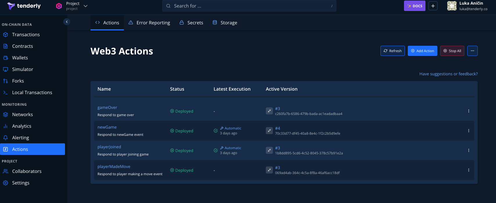
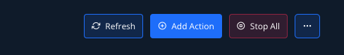
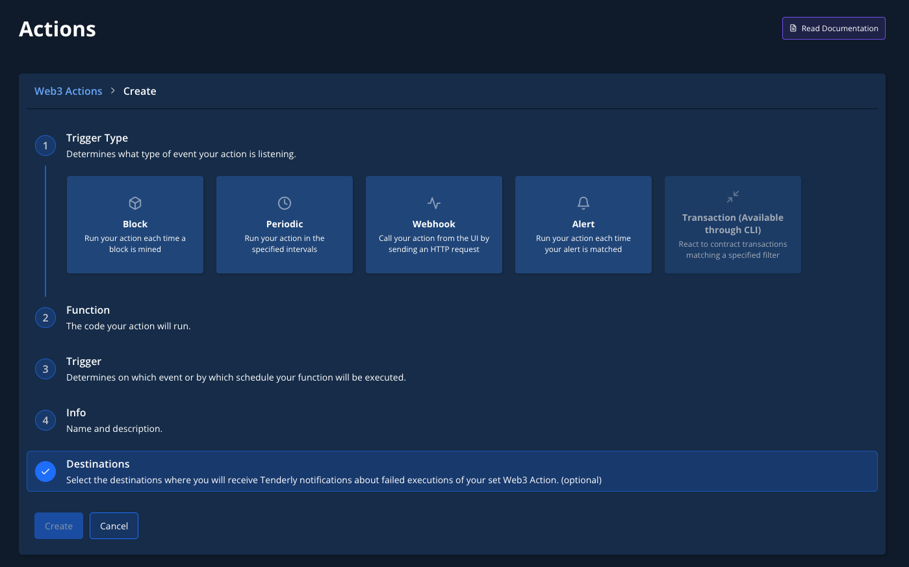
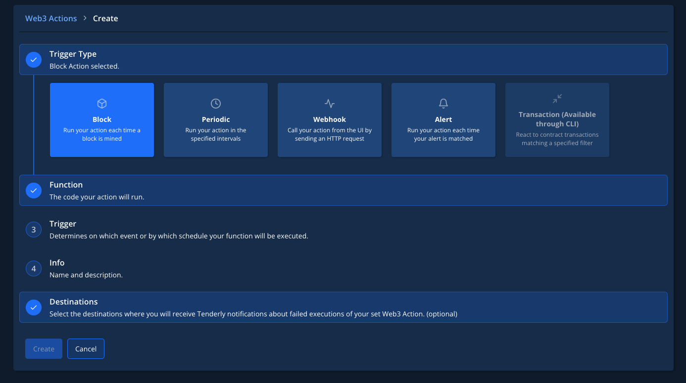
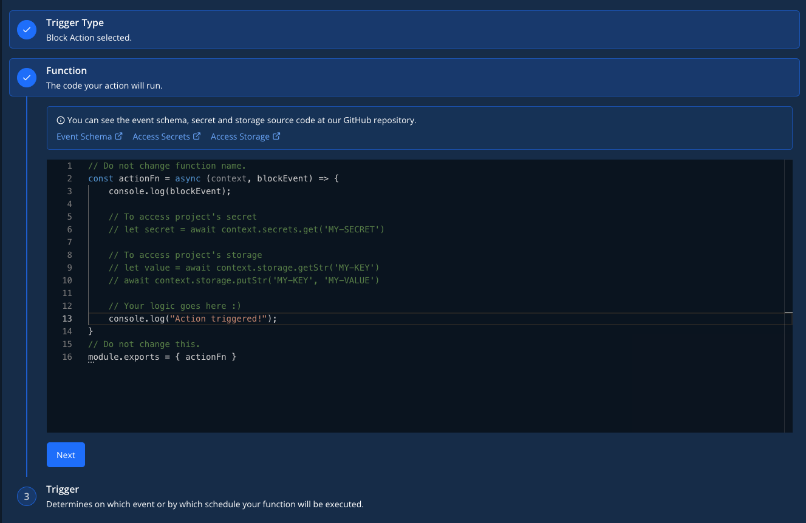
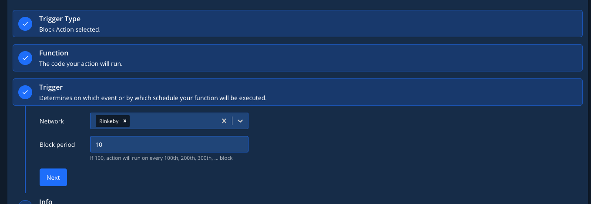
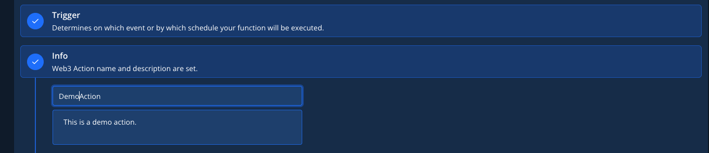
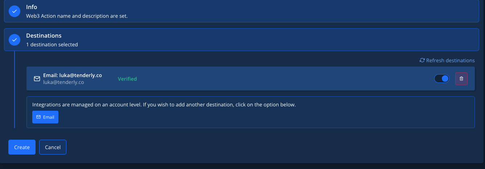
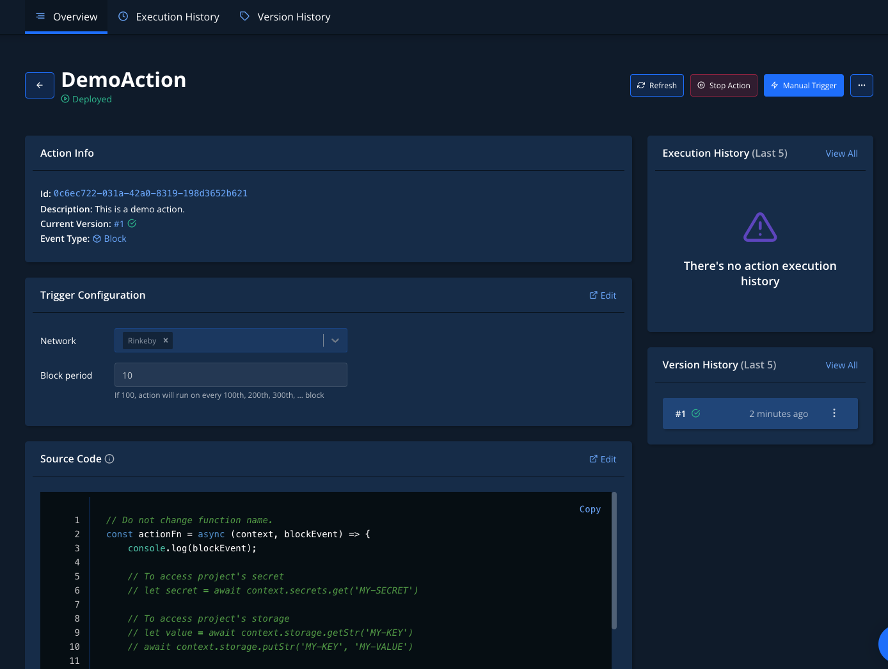
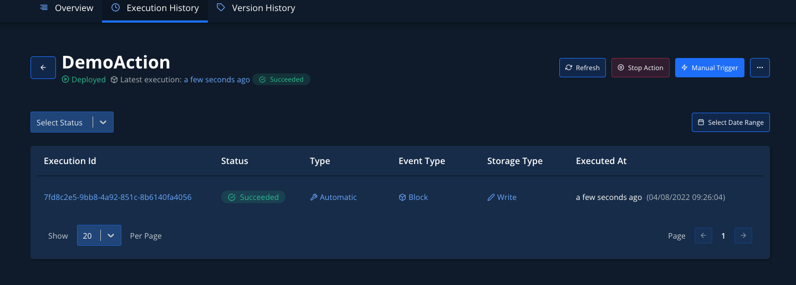

# Deploy Web3 Actions via Dashboard

This guide shows you how to create a Web3 Action via the Web3 Action builder in the Tenderly Dashboard. Though a practical example, you’ll learn how to create a Web3 Action that logs a message to the console every time 10 blocks get mined on the Mainnet.

### Creating a Web3 Action


To continue, [log into your account](https://dashboard.tenderly.co/) or [create a free account](https://dashboard.tenderly.co/register) if you don’t have one.


Once logged in, create a new [Tenderly project](https://docs.tenderly.co/projects) or select an existing one where you want to create your Web3 Action.

From the left-hand menu, select **Actions**, where you’ll see a list of Web3 Actions you’ve already created in your project.

<figure><figcaption>
Navigating to the Actions section
</figcaption></figure>

If you recently created a project, the list will be empty and you’ll have to click the **Add Action** button to create your first Web3 Action.

<figure><figcaption>
Creating a Web3 Action
</figcaption></figure>

The process involves three steps:

1. **Select a trigger type**: Choose an on-chain or off-chain event that will trigger the execution of your custom code.
2. **Write or add your custom code (functions):** Your application logic written in JavaScript or TypeScript to be executed when the event occurs.
3. **Specify trigger details:** Each pre-defined trigger (event) has its settings. The last step is to configure the trigger itself. For example, for the Block event, you can choose the network to be monitored and the number of blocks to be mined for the event to get triggered.

<figure><figcaption>
Configuring a new Web3 Action
</figcaption></figure>

#### **Step 1: Choose the trigger type**

Choose the event you want the Web3 Action to listen for (the event that will trigger your custom code to run).&#x20;

For example, run your custom code (outlined in the next step) every time a block is mined on the Rinkeby network.

<figure><figcaption>
Choosing a trigger type for your Web3 Action
</figcaption></figure>

#### **Step 2: Add your custom code**

Under the Functions section, paste or write your custom JavaScript or TypeScript code directly. This is the custom logic that will be executed once a block is mined. Learn more about [Web3 Actions functions](../reference/action-functions-events-and-triggers.md#action-functions).

For example, log the message “Action triggered” to the console \*\*once a block is mined.

<figure><figcaption>
Adding your custom Web3 Action code
</figcaption></figure>


Tenderly provides [several JavaScript libraries](../reference/action-functions-events-and-triggers.md#available-libraries-for-dashboard-based-actions) for the functions created using the Dashboard.&#x20;


#### **Step 3:** Specify trigger settings

Specify the trigger-specific configurations. Each trigger type has different settings. Learn more about [Web3 Actions Events](../reference/action-functions-events-and-triggers.md#external-events-and-trigger-types) and how to configure them.

For the Block trigger type, you need to define two additional parameters: the network (Rinkeby) and the block period (10). This means that our code will get executed every 10th block mined on the Rinkeby network.

<figure><figcaption>
Specifying trigger settings
</figcaption></figure>

#### Step 4: Add the title and description

In the **Info** section, add the Web3 Action and title and description. The title and description don’t influence the behavior of your Web3 Actions.

<figure><figcaption>
Adding a title and a description for your Web3 Action
</figcaption></figure>

Optionally, you can select where you’d like Tenderly to send you notifications about failed Web3 Actions. To receive email notifications, activate the toggle. While this step is optional, enabling notifications will help give you visibility into why your Web3 Actions are failing and help you build more reliable systems.

<figure><figcaption>
Activating email notifications for possible Web3 Action failure 
</figcaption></figure>

#### Step 5: Deploy your Web3 Action

When finished, click the **Create** button to build and deploy your Web3 Action. Once deployed, you’ll be forwarded to the Overview page, where you can [stop, upgrade, and delete your Web3 Action](../reference/stopping-upgrading-and-manually-running-web3-actions.md).

<figure><figcaption>
An overview of your Web3 Action
</figcaption></figure>

#### Step 6: Monitor your Web3 Action

Monitor the execution of your Web3 Actions by clicking the **Execution History** tag from the top page menu. This is where you’ll see a log entry for every execution instance of your Web3 Action.

<figure><figcaption>
Monitoring the execution of your Web3 Action
</figcaption></figure>

### Deploy and manage Web3 Actions programmatically

If you prefer to specify action triggers through YAML configuration and have your action functions in your project's code-base, follow the Quickstart on **building and deploying a Web3 Action using CLI**.


Transaction-triggered Web3 Actions can be built only using the CLI approach.


### Resources

* Learn more about [Web3 Actions Functions, Events, and Triggers](../reference/action-functions-events-and-triggers.md).
* Learn more about [Context, Storage, and Secrets](../reference/context-storage-and-secrets.md) available to action functions.
* Learn more about [Project Structure and **tenderly.yaml** configuration](../reference/project-structure.md).
