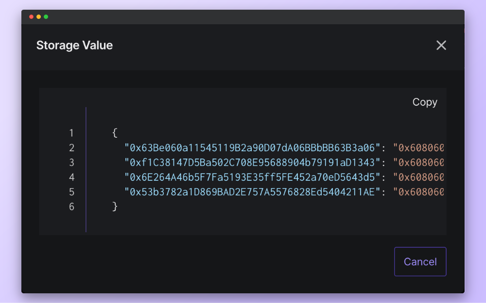

# How to Access Tenderly Node from Web3 Actions

In this tutorial, we’ll create a Web3 Action that runs each time `UniswapV2Factory` deploys a new `UniswapV2Pair` contract. The Web3 Action will compare the bytecode of the newly deployed contract with the bytecode of another `UniswapV2Pair` contract. In this case, we’ll use the USDC Pair contract.

To obtain the bytecodes, we’ll use [Tenderly Node](https://docs.tenderly.co/web3-gateway/web3-gateway) as our node provider. If the bytecodes match, the Web3 Action will store the pair’s address and contract’s bytecode in the Storage of the Web3 Action.

If you want to skip the tutorial, here’s the complete solution:

```tsx
import {
	ActionFn,
	Context,
	Event,
	Network,
	TransactionEvent,
} from "@tenderly/actions";

import { ethers } from "ethers";

import UniswapV2FactoryAbi from "./UniswapV2FactoryAbi.json"

type UniswapPair = {
	token0: string,
	token1: string,
	pair: string,
}

const USDC_PAIR_CONTRACT_ADDRESS = "0xb4e16d0168e52d35cacd2c6185b44281ec28c9dc"

export const onPairCreatedEventEmitted: ActionFn = async (context: Context, event: Event) => {
	try {
		const txEvent = event as TransactionEvent;
		const newPair = await getPairCreatedEvent(txEvent);

		const gatewayURL = context.gateways.getGateway(Network.MAINNET)
		const provider = new ethers.providers.JsonRpcProvider(gatewayURL)

		const usdcPairContract = await provider.getCode(USDC_PAIR_CONTRACT_ADDRESS)
		const newPairContract = await provider.getCode(newPair.pair)

		if (usdcPairContract === newPairContract) {
			const pairContracts = await context.storage.getJson("PairContracts")
			pairContracts[newPair.pair] = newPairContract
			await context.storage.putJson("PairContracts", pairContracts)
		}
	} catch (error) {
		console.error(error);
	}
}

const getPairCreatedEvent = async (txEvent: TransactionEvent): Promise<UniswapPair> => {
	const i = new ethers.utils.Interface(UniswapV2FactoryAbi)
	const pairCreatedTopic = i.getEventTopic("PairCreated");

	const pairCreatedEventLog = txEvent.logs.find(log => {
		return log.topics.find(topic => topic == pairCreatedTopic) !== undefined
	})

	if (pairCreatedEventLog == undefined) {
		throw Error("PairCreatedEvent missing")
	}

	return i.decodeEventLog("PairCreated",
		pairCreatedEventLog.data,
		pairCreatedEventLog.topics,
	) as unknown as UniswapPair
}
```

### Prerequisites


The triggering mechanism for Web3 Actions works only if the contract used in the trigger definition is verified on Tenderly. Learn [how to verify contracts on Tenderly here](https://docs.tenderly.co/monitoring/smart-contract-verification).


In this example, we'll be using the `UniswapV2Factory` and `UniswapV2Pair` contracts. Since both contracts are publicly verified on Tenderly, there is no need to verify them manually.

Navigate to the [UniswapV2Factory](https://dashboard.tenderly.co/contract/mainnet/0x5c69bee701ef814a2b6a3edd4b1652cb9cc5aa6f) and click the **Add to Project** button to add the contract to your project. Repeat the same step for [UniswapV2Pair](https://dashboard.tenderly.co/contract/mainnet/0xd849b2af570ffa3033973ea11be6e01b7ba661d9).

## Step 1: Define the trigger

Whenever the [`createPair` function](https://docs.uniswap.org/contracts/v2/reference/smart-contracts/factory#createpair) of the `UniswapV2Factory` contract gets called, the following occurs:

* A new [UniswapV2Pair](https://docs.uniswap.org/contracts/v2/reference/smart-contracts/pair) contract gets created for the token pair (if one doesn’t already exist)
* A [`PairCreated`](https://docs.uniswap.org/contracts/v2/reference/smart-contracts/factory#paircreated) event gets emitted

We can define the trigger to run a Web3 Action each time a transaction hitting a contract calls a function that emits a specific event.

In our case, we’ll write the trigger that fires each time a `UniswapV2Factory` contract emits a `PairCreated` event. In other words, whenever a new `UniswapV2Pair` contract is deployed.

The configuration for the trigger looks like this, and it needs to be saved in the `tenderly.yaml` file:

```yaml
account_id: ""
actions:
  YOUR_USERNAME/YOUR_PROJECT_SLUG:
    runtime: v2
    sources: actions
    specs:
      uniswapNewPair:
        description: Runs when a new pair is created on uniswap
        function: uniswapActions:onPairCreatedEventEmitted
        trigger:
          type: transaction
          transaction:
            status:
              - mined
            filters:
              - network: 1
                eventEmitted:
                  contract:
                    address: 0x5C69bEe701ef814a2B6a3EDD4B1652CB9cc5aA6f
                  name: PairCreated
project_slug: ""
```

## Step 2: Define the Web3 Action logic

When our Web3 Action runs, it receives two inputs:

* A [`context`](https://docs.tenderly.co/web3-actions/references/context-storage-and-secrets)object that provides access to Tenderly Node and Storage
* A [`transactionEvent`](https://docs.tenderly.co/web3-actions/references/action-functions-events-and-triggers#transaction-event) payload containing data relevant to the transaction that triggered the Web3 Action

We’ll use the `context` object to access `gateways`, which will be our node provider for Ethers and Storage for storing matched bytecode.


Learn [how to use Tenderly Node in Web3 Actions](https://docs.tenderly.co/web3-actions/references/web3-gateway-access) to access any of the supported networks, including Mainnet, without the hassle of managing URLs or secret keys.


As for the `transactionEvent` payload, we’ll use its `logs` property to find the event log corresponding to the `PairCreated` topic.

### Step 2.1: Decode the PairCreated event

When triggered, the Web3 Action needs to find the `PairCreated` event in the payload’s logs. We’ll put this code in the `getPairCreatedEvent` function.

To get the hash for the `PairCreated` topic, we need to use the ABI of the `UniswapV2Factory` contract. To do so, go to the `UniswapV2Factory` [contract in Tenderly](https://dashboard.tenderly.co/contract/mainnet/0x5c69bee701ef814a2b6a3edd4b1652cb9cc5aa6f), click **View ABI** and copy/paste it to a local file in the `actions` directory.


Explore the [project structure of a Web3 Action here](https://docs.tenderly.co/web3-actions/references/project-structure).


Now we can get the reference of that topic with the following code:

```tsx
	const i = new ethers.utils.Interface(UniswapV2FactoryAbi)
	const pairCreatedTopic = i.getEventTopic("PairCreated");
```

Next, we need to go through the transaction logs and find the entry referencing that topic like so.

```tsx
	const pairCreatedEventLog = txEvent.logs.find(log => {
		return log.topics.find(topic => topic == pairCreatedTopic) !== undefined
	})
```

Finally, we’ll be decoding the log entry into the `UniswapPair` type using Ethers.

The result of the `getPairCreatedEvent` function is then an object that contains the following:

* Addresses of the tokens constituting the pair - `token0` and `token1` properties
* Address of the deployed `UniswapV2Pair` contract - `pair` property

## Step 3: Compare the bytecodes

Now that we have the address of the newly deployed contract (contained in the `pair` property of the `UniswapPair` type), we can use it to get the contract’s bytecode.

We’ll be using the `USDC UniswapV2Pair` contract’s bytecode to determine if the newly created contract’s bytecode is a valid `UniswapV2Pair` contract. Their bytecodes must match exactly.

To get the bytecodes of those contracts, we need to use the Ethers `getCode` function.

To complete these steps, we first need to set up a node provider — Tenderly Node: `gateways`.

By accessing the `gateways` property of the `context` object, we can easily obtain the JSON-RPC URL for our desired network (`MAINNET`, in our case) by invoking the `getGateway()` function and using it as the provider for Ethers.

```tsx
const gatewayURL = context.gateways.getGateway(Network.MAINNET)
const provider = new ethers.providers.JsonRpcProvider(gatewayURL)
```

This will allow us to get the bytecode of both the new pair and the USDC pair.

```tsx
const usdcPairContract = await provider.getCode(USDC_PAIR_CONTRACT_ADDRESS)
const newPairContract = await provider.getCode(newPair.pair)
```

If there is a match, we want to store the bytecode of the new pair in the format `pair_address: bytecode` under a JSON property named `PairContracts` in our project’s Storage:

```tsx
if (usdcPairContract === newPairContract) {
	const pairContracts = await context.storage.getJson("PairContracts")
	pairContracts[newPair.pair] = newPairContract
	await context.storage.putJson("PairContracts", pairContracts)
}
```

After letting the Web3 Action run for a while, we can check the project’s Storage and view the created pairs:

<figure><figcaption></figcaption></figure>

The keys are the addresses of the newly deployed `UniswapV2Pair` contracts, while the values are all the same and represent the bytecode of the `UniswapV2Pair` contract.
