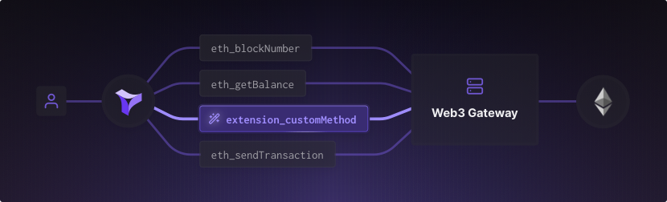

# Node Extensions

<figure><figcaption><p>Node Extensions</p></figcaption></figure>

Node Extensions provide a powerful way to create and deploy custom JSON-RPC endpoints that encapsulate functionalities specific to your dapp or protocol. This allows you to go beyond the elementary operations offered by the JSON-RPC standard.&#x20;

Instead, you can create higher abstractions for interacting with the blockchain, capture your logic in one place, and make it easier to integrate it into UIs and backends. This way, you enable other dapps or protocols to achieve easier composability.

A Node Extension consists of Javascript/Typescript code that processes a JSON-RPC request at your custom endpoint. When you activate an extension in a project, it becomes available as a new Tenderly Node endpoint.

You can create a fully custom Node Extension in 4 ways:

* Build an extension from scratch, encapsulating your logic in Javascript/Typescript.
* Re-purpose a Web3 Action into an extension.
* Re-use an existing Node Extension coming from our open [Node Extensions Library](https://github.com/Tenderly/node-extensions-library). You can contribute to the Node Extensions Library. This way, you can make reusability easier and enable other projects to integrate your abstractions.
* Use the Node Extensions Command Line Interface (CLI) to initialize and deploy your extensions. This tool is particularly useful for integrating Node Extensions into your development workflow and automating the deployment process​.


Before you can start using Node Extensions, you need to [create an account](https://dashboard.tenderly.co/register?redirectTo=node-extensions) on the Tenderly platform and be familiar with the basics of [Tenderly Node](./), our Node-as-a-Service solution. You should also have working knowledge of JavaScript or TypeScript and [JSON-RPC methods](references/brief-json-rpc.md).



All Node Extensions method names must start with `extension_` prefix.


## Creating a Node Extension

Let's explore the ways you can create a Node Extension:

* **Creating a (private) custom Node Extension** from scratch by providing JS/TS code that encapsulates your custom operations
* **Creating a Node Extension from the Node Extension Library** (from a [public GitHub repo](https://github.com/Tenderly/node-extensions-library)). This is a community-sourced library of extensions, making it easy to share extensions with others and enabling reusability and composability.
* **Using an existing Web3 Action** as the basis for a new Node Extension.
* Using the **Node Extensions Command Line Interface (CLI)** to easily initialize and deploy your extensions. This is a great way to manage your extensions programmatically, and fits seamlessly into automated workflows.


If your node extensions use API keys, secrets, or other sensitive information, you can use [Web3 Action Secrets](https://docs.tenderly.co/web3-actions/references/context-storage-and-secrets#secrets) to securely store and access this information from code. To retrieve a secret, use `await context.secrets.get('API_KEY')` in your Node Extension.


### Creating a custom Node Extension from scratch

To create a new Node Extension, open the [Tenderly Dashboard](https://dashboard.tenderly.co/register?redirectTo=node-extensions), click **Node** in the sidebar on the left, navigate to the **Node Extensions** tab, and click the **Create Custom Extension** button.&#x20;

You can then define the custom JSON-RPC method name and write the JS/TS code that will be executed each time the method is called. After that, you can [manually test your node extension](node-extensions.md#testing-a-node-extension).&#x20;


How to Create a Custom Node Extension


Keep your code simple and easy to understand, and test thoroughly to ensure that your Node Extension is working correctly.&#x20;


[Broken link](broken-reference)


<figure><figcaption><p>Create New Extension Modal</p></figcaption></figure>

### Creating a Node Extension from a Web3 Action

If you've already created a [Web3 Action](../web3-actions/intro-to-web3-actions.md) with a non-authenticated [webhook trigger type](../web3-actions/references/action-functions-events-and-triggers.md), you can use its source code as the function of your Node Extension. To do this, simply navigate to the **Node Extensions** tab in the Tenderly Dashboard and click the **Create Custom Extension** button.

From there, select the relevant Web3 Action from the dropdown menu. This automatically populates the function field with the Javascript/Typescript code from your Web3 Action.&#x20;


After the Node Extension is successfully created, the extension automatically picks up any changes to the source code of the connected Web3 Action.


After that, you can [manually test your node extension](node-extensions.md#testing-a-node-extension).&#x20;

<figure><figcaption><p>Create New Extension from existing Web3 Action</p></figcaption></figure>

### Creating a Node Extension from the Node Extension Library

To help you get started, you can use the Node Extension Library to enable a ready-made node extension in one click. You can use these ready-made extensions to get inspired and start experimenting with your own extensions.&#x20;


We'll add new extensions over time, so be sure to check the library for updates regularly.



How to Activate an Extension from the Node Extension Library


To activate a Library Node Extension, navigate to the **Node Extensions** tab in the Tenderly Dashboard and click the **Add From Library** button. When you open the modal, you'll see the list of all [publicly available Node Extensions](https://github.com/Tenderly/node-extensions-library). Each template has a GitHub link to the source code.

Next, click the **Activate** button to set up a pre-defined Node Extension with its corresponding Web3 Action that represents the source code of the extension.

After that, you can [manually test your node extension](node-extensions.md#testing-a-node-extension).&#x20;

<figure><figcaption><p>Node Extension Library Modal</p></figcaption></figure>


If you encounter any issues when working with Node Extensions, please refer to the Tenderly platform documentation or reach out to our support team for assistance. It's also a good idea to keep your code well-documented and test thoroughly to ensure that your Node Extension works as expected.



Editing the Node Extensions from the Node Extension Library isn't possible. To further customize a Node Extension, you need to create a Custom Node Extension.


After enabling Node Extensions, you'll be directed to the Node Extension page where you can view all of your enabled extensions. Each card displays the extension name, method name, description, author, and clickable icon.&#x20;

If you created a Node Extension using a library example, a GitHub icon with a link to its source code will be displayed. If it's a custom Node Extension, the Web3 Action with the corresponding status and source code will be linked.

<figure><figcaption><p>Node Extensions Page</p></figcaption></figure>

### Creating a Node Extension from CLI

The [Tenderly CLI](https://github.com/Tenderly/tenderly-cli) now supports operations related to Node Extensions. This allows you to extend the functionalities of the Tenderly node and create custom JSON-RPC endpoints that encapsulate functionalities specific to your dapp or protocol from the command line.

#### Initializing Node Extensions

The `tenderly node-extensions init` command initializes the `node_extensions` section of your `tenderly.yaml` file. It takes the following arguments:

* **name**: Specifies the extension name.
* **description**: Specifies the extension description.
* **methodName**: Specifies the extension method name. Note that all Node Extensions method names must start with the `extension_` prefix​​.

```
tenderly node-extensions init --name "extension-name" --description "extension description" --methodName "extension_test"
```

<figure><figcaption><p>Choosing the Web3 Action while creating a Node Extension</p></figcaption></figure>

<figure><figcaption><p>Successfully initialized Node Extension</p></figcaption></figure>

After running this command, you'll get something like this:

<figure><figcaption><p>Project structure</p></figcaption></figure>


```yaml
account_id: ""
actions:
  ACCOUNT_NAME/PROJECT_SLUG:
    runtime: v2
    sources: actions
    specs:
      example:
        description: Non-authenticated webhook example
        function: example:nodeExtensionFn
        trigger:
          type: webhook
          webhook:
            authenticated: false
node_extensions:
  ACCOUNT_NAME/PROJECT_SLUG:
    specs:
      extension-name:
        description: extension description
        method: extension_test
        action: example
project_slug: ""
```



```typescript
import {
  ActionFn,
  Context,
  Event,
  ExtensionEvent,
} from '@tenderly/actions';

export const nodeExtensionFn: ActionFn = async (context: Context, event: Event) => {
  const extensionEvent = event as ExtensionEvent;
  console.log({ extensionEvent });
  return extensionEvent;
};
```



Before you can use the `tenderly node-extensions init` command, you must first set up a [Web3 Action](../web3-actions/tutorials-and-quickstarts/deploy-web3-action-via-cli.md). To do this, you can use the `tenderly actions init` command from the CLI. This Web3 Action should be configured as a non-authenticated webhook event.


The command first validates the provided `methodName` and then prompts you to select one action from a list of those eligible for extensions, presented in the format `account/project:action`. The list only includes actions that aren't already used by other extensions in the `tenderly.yaml` file. If no actions are eligible for extensions, or if all eligible actions are already used by other extensions, the command will return an error. After an action is selected, the command checks if the chosen extension method name is already used by another extension in the same `account/project`. If it isn't, the extension is added to the `tenderly.yaml` file.

#### Deploying Node Extensions

```
tenderly node-extensions deploy
```

The `tenderly node-extensions deploy` command deploys extensions specified in the `tenderly.yaml` file. It accepts the following arguments:

* **account**: Specifies the account for which the extension is defined in the `tenderly.yaml` file.
* **project**: Specifies the project for which the extension is defined in the `tenderly.yaml` file.
* **extensionName**: Specifies the extension in the provided `account/project` that should be deployed.

If no arguments are provided, the command will attempt to deploy all extensions defined in the `tenderly.yaml` file. If any of these extension deployments fail, the command will print out the failure reasons and continue with the deployment.


Ensure that the corresponding Web3 Action is deployed in your project before deploying a Node Extension using the CLI. The deployment of the Web3 Action is a prerequisite for the Node Extension. If you attempt to deploy a Node Extension without a previously deployed Web3 Action, the process will fail with an error message.


<figure><figcaption><p>Successfully deployed Node Extension in the Tenderly Dashboard</p></figcaption></figure>

## Testing a Node Extension

After creating a Node Extension, you should test it to make sure it's working properly. To do this, click the **Test** button within the Node Extension card to open the **Test Node Extension** modal.

The modal contains a JSON-RPC Request Builder, which you can use to create a JSON input payload for your custom method name. This payload should contain any necessary data or parameters that your Node Extension needs to execute correctly.

Once you've created your JSON input payload, click the **Send** button to execute your Node Extension. You'll see the request and response previews in the modal, showing you the exact data that was sent and received.

<figure><figcaption><p>Test Node Extension</p></figcaption></figure>

## Editing Node Extensions

Node Extensions made from the Node Extension Library cannot be edited. However, if the extension is custom-made, it can be edited in two ways:

* If you created the extension using the Tenderly CLI, the extension needs to be redeployed from the CLI.
* If you created the extension from the Tenderly Dashboard, you can edit the extension directly from the Dashboard.

You can see the connected Web3 Action when you open the extension card and go to the single node extension page view. Clicking on the connected Web3 Action takes you to the Web3 Action page. It's important to note that any changes to the extension will require changes to the connected Web3 Action.


Editing is disabled for Node Extensions made from the Node Extension Library.


## Activating and deactivating Node Extensions

You can activate or deactivate Node Extensions depending on your needs. Here's what you need to know about the activation and deactivation process:

### Custom Node Extensions

If you create a custom Node Extension, deactivation simply pauses its execution. This means that the extension won't be executed when its corresponding method name is called. To reactivate the Node Extension, simply click the **Activate** button.


Note that if the associated Web3 Action is stopped, you won't be able to test or run the Node Extension. Make sure that the Web3 Action is running before attempting to activate or test the Node Extension.


### Library Node Extensions

If you create a Node Extension from the Library, deactivation permanently deletes the extension and its associated Web3 Action from your list. This cannot be undone, so make sure you want to permanently delete the Node Extension before deactivating it.

## Node Extension Page

Opening an extension card takes you to the Node Extension page, where you can view detailed information about the extension. The information includes the source code of the extension, its name, description, when it was created, and which Web3 Action is linked to it.

If you no longer need a Node Extension, you can delete it from the Node Extension page. Simply click the **Delete** button to permanently remove the extension from your Tenderly account.


Please keep in mind that if you delete a Node Extension, the associated Web3 Action will also be deleted permanently. This action cannot be undone.


<figure><figcaption><p>Node Extension Page</p></figcaption></figure>

## Contributing to the Node Extension Library

We welcome contributions to our public GitHub repository, which contains Node Extension examples and extension starter code. By contributing to our open-source community library, you can help others learn from your work and potentially inspire new use cases. Additionally, it becomes easier to share extensions among different projects and protocols, making integrations and composition easier.


Please note that the public [GitHub repository for our Node Extensions Library](https://github.com/Tenderly/node-extensions-library) contains Node Extension examples and starter code snippets. Feel free to explore and contribute to our repository as you see fit.


### How to contribute

To contribute to our repository, simply open a [pull request](https://github.com/Tenderly/node-extensions-library) with your node extension source code and a detailed description of its use case. We encourage you to include any relevant information or resources that can help others understand and use your node extension. This can include documentation, diagrams, or even video tutorials.

Once your pull request is reviewed and approved, your node extension will be added to our repository and made available for others to use and build upon. You will also be credited as the author of the node extension, which can help you build your reputation within the community.


We encourage users to submit their node extensions with detailed use cases to [GitHub](https://github.com/Tenderly/node-extensions-library). By sharing your node extension with the community, you can help others learn from your work and potentially inspire new use cases for the feature.

In addition, sharing your code on GitHub can help you receive feedback and contributions from other developers, which can lead to improvements and new ideas for your node extension. By contributing to the open-source community, you can help advance the ecosystem and drive innovation forward.

