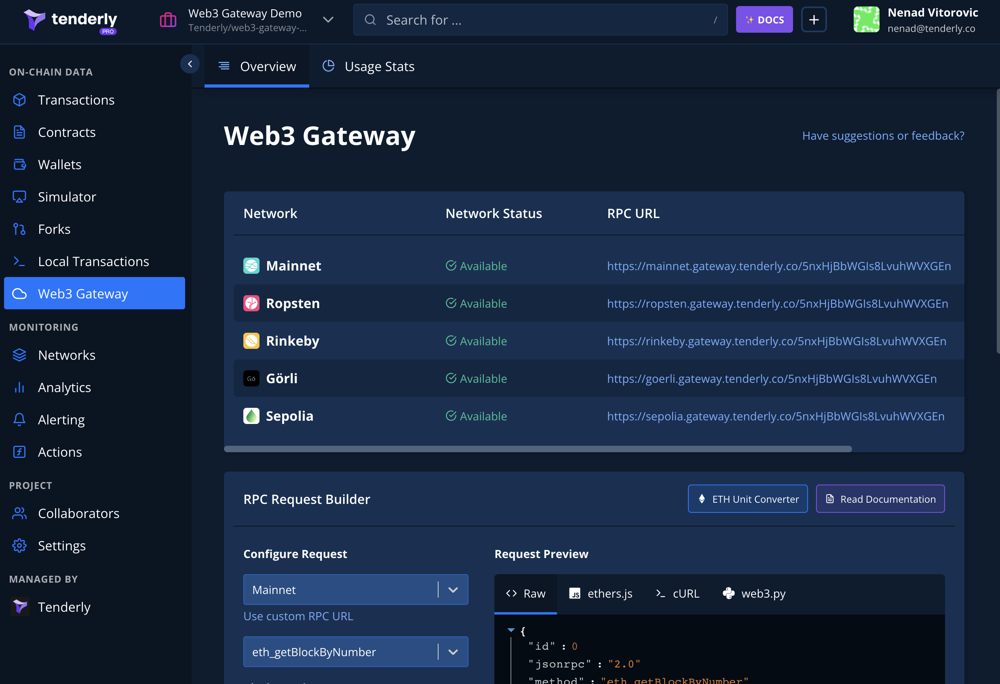
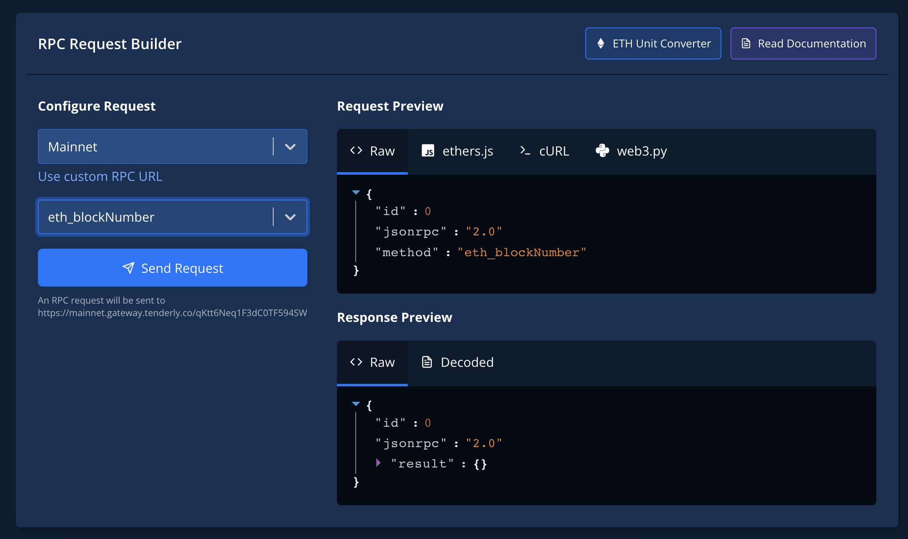
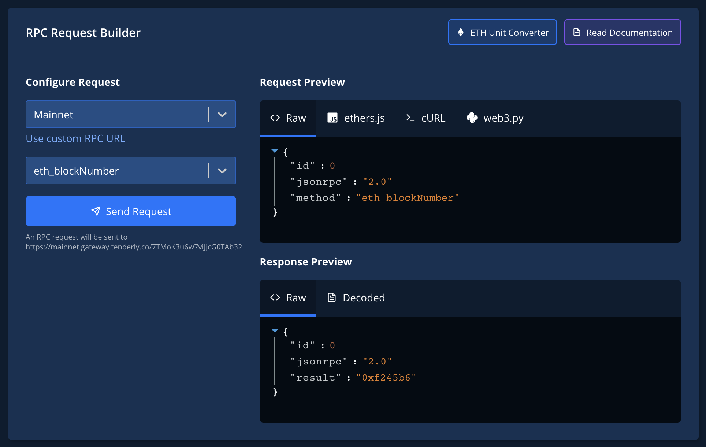
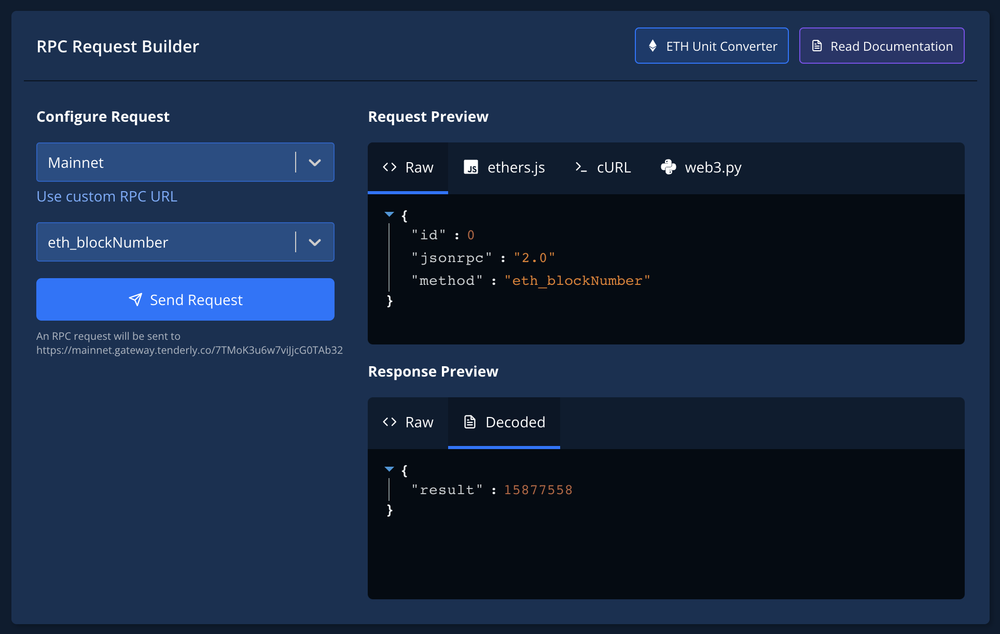
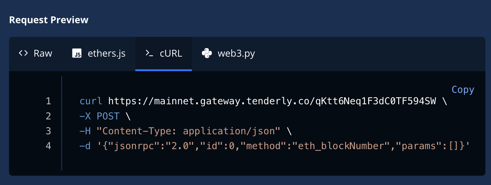

# Quickstart: Querying blockchain data

This how-to guide will guide you through using Tenderly Node to query the Mainnet for the latest block number.

## Query Mainnet's latest block number

On the left-side menu, click **Node**. This will open the Tenderly Node page, presenting the list of networks and Request builder.

Below the list of networks, you'll find the request builder.

**Step 1:** From the first drop-down menu, select Mainnet. **Step 2:** From the second dropdown, select **eth\_blockNumber**. This JSON RPC method will return the latest block number on the network.

**Step 3**: Click **Send Request**. The result with the latest block number will show up in the lower pane. Results are shown in JSON RPC response format.

**Step 4**: Click the **Decoded** tab to see results in a more accessible form:

**Step 5**: In the **Request Preview** click **cURL** and click **Copy**. The cURL calling the **eth\_blockNumber** will be in your clipboard.

**Step 6:** Open a terminal, paste the command, and hit Enter. You just interacted with blockchain from your command line!

Output should be similar to the previous one:

